# Looking Upon the Seven Hills and Beyond
## Insights from San Francisco’s Property Tax Roll Data — Through the Lens of AI

<p align="center">
  
</p>

There’s something uniquely compelling about looking at a city from above. You begin to see patterns and relationships that aren’t obvious at street level. In this analysis, that vantage point isn’t physical—**it’s data**.  

San Francisco has accumulated a vast amount of detailed public data over time. The challenge today isn’t access—it’s interpretation. **How do we turn what’s already available into insights that actually matter?**  

Traditionally, that requires a combination of statistics, programming, and domain expertise. However, even experienced professionals often run into a practical constraint—**coding takes time**. Testing ideas, especially on a new dataset, can be slow and iterative. You may have a strong intuition or a promising angle, but validating it could require hours (or even days) of work. As a result, **many good ideas simply don’t get explored**.  

AI changes that dynamic.

With the right prompts, AI tools like ChatGPT can generate working analysis code quickly. The focus shifts away from writing code and toward asking better questions and interpreting results. That doesn’t diminish the role of human judgment—if anything, it makes it more important. AI handles the execution; we stay responsible for direction and interpretation. It’s a partnership: **AI extends our reach, but we decide where to look and what matters**.

This project is a practical example of that approach. With a background in data science and a recent move to San Francisco, I set out to explore the city through its property tax roll data from DataSF. Starting from a simple analytical plan, I used **ChatGPT** to generate, test, and refine the code iteratively. The first meaningful results came together in under an hour, and the analysis developed from there.

What follows is a summary of the key findings, with the emphasis on results and insights. The full code is available on GitHub.

Let’s get into it.


# San Francisco Assessor Roll Data Analysis
## A portfolio-style structural study of value, neighborhood geography, and the Two Housing Circuits of San Francisco housing

<p align="center">
  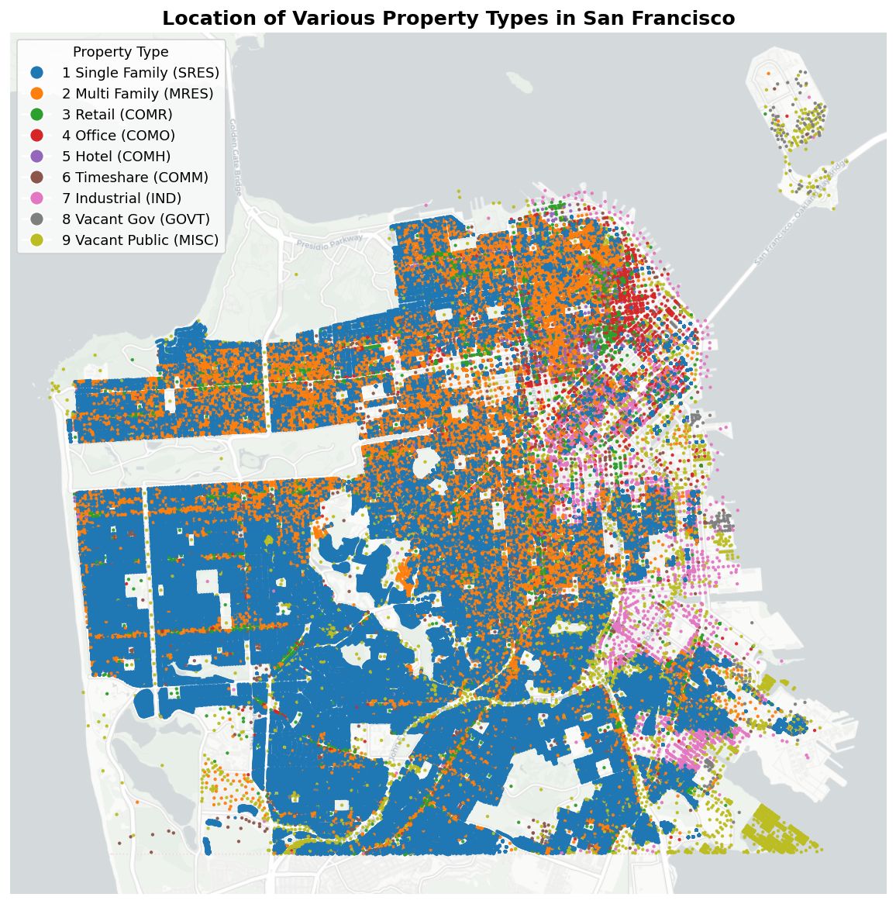
</p>

<p align="center"><em>Administrative tax-roll data can be more than a bookkeeping system. In this report it becomes a structural map of San Francisco: where value sits, where different land uses cluster, which parts of the city are older or newer, and which parts of the housing stock actually circulate through the market.</em></p>

---

## Project motivation

The San Francisco secured property tax roll is a large administrative dataset. On its face, it is about assessed values, parcel identifiers, and land-use categories. But with careful cleaning and interpretation, it can do much more:

- turn a raw roll into a usable geospatial housing dataset;
- show how San Francisco's property stock is distributed across neighborhoods and property types;
- distinguish between the **full stock of housing** and the **subset of housing that actually circulates through the market**;
- reveal why two homes in the same city can belong to very different economic worlds.

This notebook approaches the assessor roll as a city-structure dataset rather than just a valuation table. The central objective is to understand not only **how much housing exists**, but **which parts of that housing stock are active, liquid, owner-oriented, investor-oriented, old, new, stable, or recycling through turnover**.

That leads to the report's main conclusion:

> **San Francisco does not behave like one unified housing market. It behaves like two overlapping housing circuits:**
>
> - a **legacy circuit** of older, tightly held, slower-moving homes; and
> - a **circulation circuit** of homes that return to the market more frequently and absorb a disproportionate share of new demand.

This interpretation is built directly from the report's spatial maps, trend tables, ownership proxies, turnover summaries, and holding-period decay analysis.

---

## What this analysis does

The notebook proceeds in a deliberate sequence so that the later interpretations rest on transparent data choices rather than black-box modeling.

1. It loads the historical secured roll using an explicit schema so fields keep the intended types.
2. It parses geometry and converts the assessor roll into a geospatial dataset.
3. It tests whether small auxiliary value fields such as fixtures and personal property are material enough to matter for broad analysis.
4. It defines a core **total assessed value** measure based on land value plus improvement value.
5. It summarizes San Francisco's property stock by broad property category.
6. It maps where those categories sit in the city and examines how their counts evolve through time.
7. It compares property categories not only by parcel counts but also by **median parcel value** and **aggregate tax-base contribution**.
8. It narrows the focus to **single-family homes** and **condominiums**, the two housing segments most relevant to owner entry, market competition, and neighborhood comparison.
9. It studies those two housing segments through five complementary lenses:
   - total assessed value,
   - assessed value per square foot,
   - building age,
   - recent transactions,
   - owner-occupied versus renter/investor-oriented behavior.
10. It ends with a dynamic turnover analysis based on **years since last sale** and exponential decay fitting.

---

## Why the methodology matters

This project is not trying to estimate true market prices from assessor data. It is doing something more structural:

- **Assessed value** is used as a citywide comparative signal, especially helpful for neighborhood ranking and tax-base structure.
- **Recent-sales filtering** is used because under **Proposition 13**, long-held properties may have assessments anchored to old base-year values.
- The **homeowner exemption** is used as an **owner-occupied proxy**, not as a perfect legal classification.
- **Years since last sale** is used to distinguish housing that is present in the city from housing that is actually participating in the city's current exchange process.

That distinction becomes crucial later. A city can have a large housing stock on paper while still offering only a thin stream of homes for actual purchase. This report shows why.

---

## Important interpretation note

California's assessment structure matters throughout this report.

Under Proposition 13, properties that have not changed hands in many years can carry assessed values far below current market value. By contrast, recently purchased homes are usually reassessed closer to contemporary market conditions. That means:

- long-held housing stock tells a story about **continuity and embedded ownership history**;
- recently sold stock tells a story that is **closer to the current market**;
- the gap between the two is itself economically meaningful.

The report therefore separates **headline housing stock** from **circulating housing stock** whenever possible.

---

## Visual guide to the city

<p align="center">
  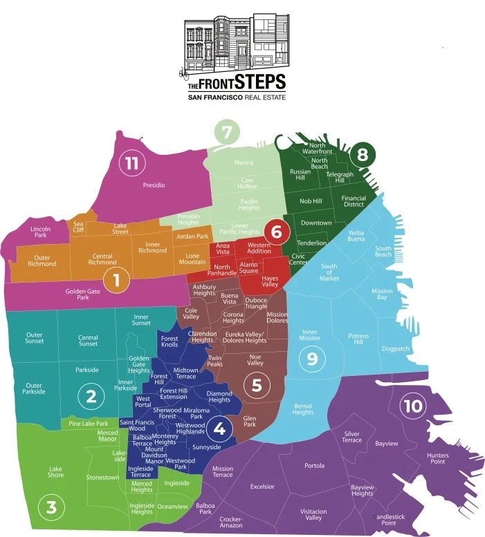
</p>

<p align="center"><em>District reference map used to interpret assessor-neighborhood labels in the tables below.</em></p>

---

## Section 1. Citywide property-stock structure

The assessor roll contains many detailed use codes. For citywide structure, the notebook groups them into broader categories such as:

- single-family residential,
- multi-family residential,
- retail,
- office,
- hotel,
- industrial,
- public / vacant-government land.

The first question is simple but important: **what kinds of properties make up San Francisco's built environment, and where are they located?**

### Figure 1. Citywide property-type map

<p align="center">
  
</p>

<p align="center"><em>Static citywide point map showing the spatial concentration of major property types across San Francisco.</em></p>

### Key findings

The neighborhood concentration pattern is strongly consistent with San Francisco's built form:

- **Single-family homes** are concentrated in outer and hill-oriented neighborhoods such as Bernal Heights, Parkside, Central Sunset, and Excelsior.
- **Multi-family housing** is densest in urban neighborhoods such as Inner Mission, Central Richmond, Noe Valley, Inner Richmond, and Inner Sunset.
- **Office and hotel uses** cluster in the downtown core—especially Financial District North, Union Square, Financial District South, South of Market, and Civic Center.
- **Industrial parcels** concentrate in Bayview, Potrero Hill, South of Market, and Dogpatch / Central Waterfront.
- Government / vacant land has its own distinct geography and does not behave like ordinary taxable housing stock.

The map matters because raw counts alone cannot show whether a category is corridor-based, waterfront-oriented, diffuse, or core-concentrated.

### Tables

<details>
<summary><strong>Top 5 neighborhoods by property count within each property type</strong></summary>

<table>
<caption>Top 5 neighborhoods by property count within each property type</caption>
<thead>
<tr>
<th>Property Type</th>
<th>1 Single Family (SRES)</th>
<th>2 Multi Family (MRES)</th>
<th>3 Retail (COMR)</th>
<th>4 Office (COMO)</th>
<th>5 Hotel (COMH)</th>
<th>6 Timeshare (COMM)</th>
<th>7 Industrial (IND)</th>
<th>8 Vacant Gov (GOVT)</th>
<th>9 Vacant Public (MISC)</th>
</tr>
<tr>
<th>Rank</th>
<th> </th>
<th> </th>
<th> </th>
<th> </th>
<th> </th>
<th> </th>
<th> </th>
<th> </th>
<th> </th>
</tr>
</thead>
<tbody>
<tr>
<th>1</th>
<td>9A Bernal Heights</td>
<td>9C Inner Mission</td>
<td>9C Inner Mission</td>
<td>8B Financial District North</td>
<td>8B Financial District North</td>
<td>8A Downtown</td>
<td>10A Bayview</td>
<td>9I Treasure Isl./Yerba Buena Isl.</td>
<td>10M Candlestick Point</td>
</tr>
<tr>
<th>2</th>
<td>2D Parkside</td>
<td>1A Central Richmond</td>
<td>8B Financial District North</td>
<td>8I Union Square</td>
<td>8J Tenderloin</td>
<td>6B Hayes Valley</td>
<td>9F South of Market</td>
<td>10J Hunters Point</td>
<td>10A Bayview</td>
</tr>
<tr>
<th>3</th>
<td>2E Central Sunset</td>
<td>5C Noe Valley</td>
<td>9F South of Market</td>
<td>9F South of Market</td>
<td>9F South of Market</td>
<td>8E Russian Hill</td>
<td>9C Inner Mission</td>
<td>10A Bayview</td>
<td>9A Bernal Heights</td>
</tr>
<tr>
<th>4</th>
<td>9H South Beach</td>
<td>1B Inner Richmond</td>
<td>8I Union Square</td>
<td>9B Financial District South</td>
<td>8A Downtown</td>
<td>9C Inner Mission</td>
<td>9E Potrero Hill</td>
<td>9J Central Waterfront/Dogpatch</td>
<td>10J Hunters Point</td>
</tr>
<tr>
<th>5</th>
<td>10C Excelsior</td>
<td>2F Inner Sunset</td>
<td>6C Lower Pacific Heights</td>
<td>8F Van Ness/ Civic Center</td>
<td>8I Union Square</td>
<td>8F Van Ness/ Civic Center</td>
<td>9J Central Waterfront/Dogpatch</td>
<td>9D Mission Bay</td>
<td>10D Outer Mission</td>
</tr>
</tbody>
</table>

</details>


---

## Section 2. How property types change over time

This section shifts from a single-year map to long-run structure.

### Figure 2. Property counts over time by category

<p align="center">
  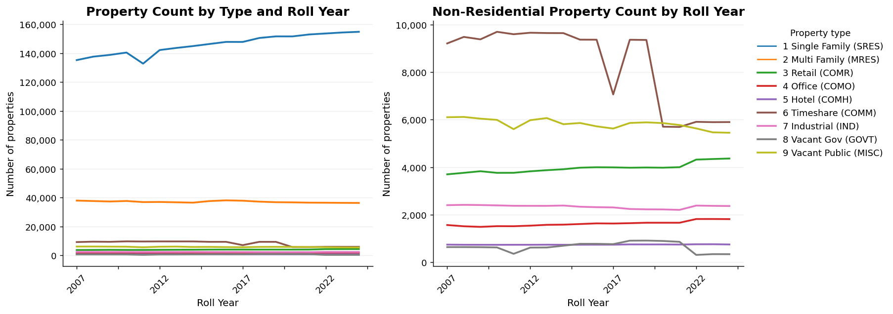
</p>

<p align="center"><em>Absolute counts of broad property categories across roll years.</em></p>

### Figure 3. Average property-type shares over time

<p align="center">
  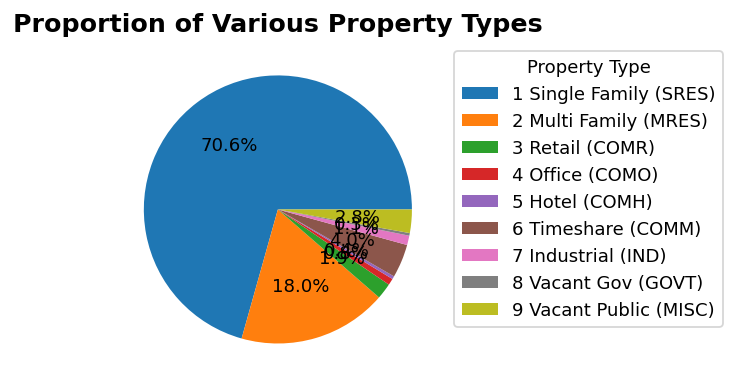
</p>

<p align="center"><em>Long-run mean composition of the property roll by category.</em></p>

### Observations

The roll composition is surprisingly stable, but not static.

- In **2024**, the roll contains **154,886 single-family** records and **36,320 multi-family** records, confirming that residential parcels dominate the dataset by count.
- Single-family records fell from **140,514 in 2010** to **132,843 in 2011**, a drop of about **5.5%**, before recovering and reaching a new high by 2024.
- Multi-family records drifted down modestly from **37,941 in 2007** to **36,320 in 2024**, a decline of roughly **4.3%**.
- Timeshare properties decline materially after 2020, which is plausibly related to pandemic-era stress in tourism-linked uses.
- Smaller specialist categories are more cyclical. A few hundred records can look dramatic in percentage terms even when they remain small relative to the citywide stock.

The broad takeaway is that **San Francisco's property inventory changes slowly**. That matters because many contemporary housing debates are driven not by rapid stock replacement, but by pressures imposed on a stock that is already largely built out.

### Table


<details>
<summary><strong>Property counts by type and roll year</strong></summary>

<table>
<caption>Property counts by type and roll year</caption>
<thead>
<tr>
<th>use_code</th>
<th>Roll Year</th>
<th>1 Single Family (SRES)</th>
<th>2 Multi Family (MRES)</th>
<th>3 Retail (COMR)</th>
<th>4 Office (COMO)</th>
<th>5 Hotel (COMH)</th>
<th>6 Timeshare (COMM)</th>
<th>7 Industrial (IND)</th>
<th>8 Vacant Gov (GOVT)</th>
<th>9 Vacant Public (MISC)</th>
</tr>
</thead>
<tbody>
<tr>
<th>0</th>
<td>2007</td>
<td>135,285</td>
<td>37,941</td>
<td>3,703</td>
<td>1,570</td>
<td>746</td>
<td>9,209</td>
<td>2,406</td>
<td>642</td>
<td>6,104</td>
</tr>
<tr>
<th>1</th>
<td>2008</td>
<td>137,685</td>
<td>37,641</td>
<td>3,766</td>
<td>1,518</td>
<td>741</td>
<td>9,482</td>
<td>2,419</td>
<td>642</td>
<td>6,116</td>
</tr>
<tr>
<th>2</th>
<td>2009</td>
<td>138,894</td>
<td>37,313</td>
<td>3,833</td>
<td>1,493</td>
<td>739</td>
<td>9,380</td>
<td>2,411</td>
<td>638</td>
<td>6,044</td>
</tr>
<tr>
<th>3</th>
<td>2010</td>
<td>140,514</td>
<td>37,674</td>
<td>3,765</td>
<td>1,523</td>
<td>738</td>
<td>9,697</td>
<td>2,397</td>
<td>627</td>
<td>5,993</td>
</tr>
<tr>
<th>4</th>
<td>2011</td>
<td>132,843</td>
<td>36,906</td>
<td>3,767</td>
<td>1,520</td>
<td>740</td>
<td>9,595</td>
<td>2,379</td>
<td>360</td>
<td>5,603</td>
</tr>
<tr>
<th>5</th>
<td>2012</td>
<td>142,250</td>
<td>37,000</td>
<td>3,830</td>
<td>1,544</td>
<td>740</td>
<td>9,658</td>
<td>2,378</td>
<td>621</td>
<td>5,980</td>
</tr>
<tr>
<th>6</th>
<td>2013</td>
<td>143,707</td>
<td>36,766</td>
<td>3,877</td>
<td>1,579</td>
<td>743</td>
<td>9,645</td>
<td>2,377</td>
<td>625</td>
<td>6,069</td>
</tr>
<tr>
<th>7</th>
<td>2014</td>
<td>144,987</td>
<td>36,518</td>
<td>3,917</td>
<td>1,587</td>
<td>740</td>
<td>9,642</td>
<td>2,390</td>
<td>700</td>
<td>5,811</td>
</tr>
<tr>
<th>8</th>
<td>2015</td>
<td>146,447</td>
<td>37,614</td>
<td>3,982</td>
<td>1,612</td>
<td>742</td>
<td>9,367</td>
<td>2,340</td>
<td>779</td>
<td>5,862</td>
</tr>
<tr>
<th>9</th>
<td>2016</td>
<td>147,881</td>
<td>38,099</td>
<td>4,000</td>
<td>1,640</td>
<td>744</td>
<td>9,365</td>
<td>2,321</td>
<td>779</td>
<td>5,721</td>
</tr>
<tr>
<th>10</th>
<td>2017</td>
<td>147,863</td>
<td>37,857</td>
<td>3,995</td>
<td>1,634</td>
<td>743</td>
<td>7,063</td>
<td>2,311</td>
<td>766</td>
<td>5,628</td>
</tr>
<tr>
<th>11</th>
<td>2018</td>
<td>150,608</td>
<td>37,220</td>
<td>3,981</td>
<td>1,648</td>
<td>756</td>
<td>9,363</td>
<td>2,245</td>
<td>912</td>
<td>5,863</td>
</tr>
<tr>
<th>12</th>
<td>2019</td>
<td>151,720</td>
<td>36,829</td>
<td>3,990</td>
<td>1,667</td>
<td>754</td>
<td>9,354</td>
<td>2,230</td>
<td>916</td>
<td>5,889</td>
</tr>
<tr>
<th>13</th>
<td>2020</td>
<td>151,706</td>
<td>36,720</td>
<td>3,982</td>
<td>1,667</td>
<td>754</td>
<td>5,706</td>
<td>2,226</td>
<td>900</td>
<td>5,857</td>
</tr>
<tr>
<th>14</th>
<td>2021</td>
<td>153,042</td>
<td>36,514</td>
<td>4,003</td>
<td>1,667</td>
<td>749</td>
<td>5,695</td>
<td>2,208</td>
<td>864</td>
<td>5,776</td>
</tr>
<tr>
<th>15</th>
<td>2022</td>
<td>153,731</td>
<td>36,463</td>
<td>4,322</td>
<td>1,823</td>
<td>761</td>
<td>5,911</td>
<td>2,388</td>
<td>314</td>
<td>5,633</td>
</tr>
<tr>
<th>16</th>
<td>2023</td>
<td>154,421</td>
<td>36,375</td>
<td>4,347</td>
<td>1,824</td>
<td>763</td>
<td>5,897</td>
<td>2,377</td>
<td>346</td>
<td>5,468</td>
</tr>
<tr>
<th>17</th>
<td>2024</td>
<td>154,886</td>
<td>36,320</td>
<td>4,367</td>
<td>1,819</td>
<td>753</td>
<td>5,901</td>
<td>2,370</td>
<td>344</td>
<td>5,452</td>
</tr>
</tbody>
</table>

</details>


---

## Section 3. Assessed values by property type

Parcel counts alone cannot show economic importance. A category may matter because it is:

- extremely numerous,
- expensive per parcel,
- or both.

This section therefore separates two questions:

1. **What is the median assessed value of a typical parcel in each category?**
2. **What is the aggregate assessed value contribution of that category to the city's tax base?**

### Figure 4. Median and total assessed value by property type

<p align="center">
  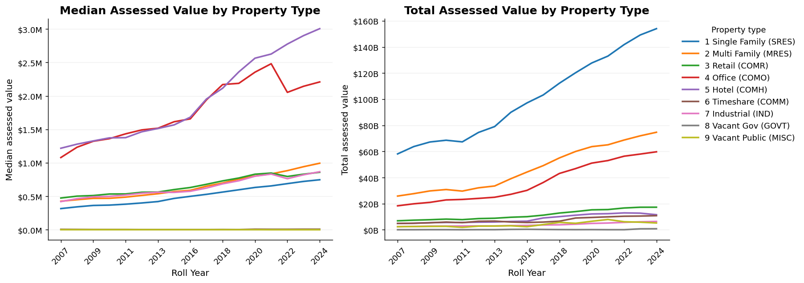
</p>

<p align="center"><em>Median parcel value and aggregate citywide assessed value across major property types.</em></p>

### Observations

At the individual-parcel level:

- The median assessed value of a **single-family** property rises from **$0.316M in 2007** to **$0.747M in 2024**, an increase of about **136%**.
- The median **multi-family** property rises from **$0.426M** to **$0.994M**, up roughly **133%**.
- Office and hotel parcels remain expensive on a per-record basis, reaching roughly **$2.2M per office parcel** and **$3.0M per hotel parcel** in 2024.
- Government-owned vacant parcels often carry very low or zero assessed values, consistent with exemption or distinct administrative treatment.

At the aggregate citywide level:

- Total assessed value for **single-family housing** increases from **$58.1B in 2007** to **$154.0B in 2024**.
- **Multi-family housing** increases from **$25.8B** to **$74.7B**.
- **Office** begins from a very large **$18.4B** base in 2007 and rises to **$59.7B**, despite far fewer parcels than the residential categories.

This is an important interpretive distinction:

> A category may matter because it is **numerous** (single-family / multi-family), because it is **valuable per parcel** (office / hotel), or because it combines both. Median parcel value and aggregate tax-base contribution answer different policy questions.

### Tables


<details>
<summary><strong>Median assessed value by property type and roll year</strong></summary>

<table>
<caption>Median assessed value by property type and roll year</caption>
<thead>
<tr>
<th>use_code</th>
<th>Roll Year</th>
<th>1 Single Family (SRES)</th>
<th>2 Multi Family (MRES)</th>
<th>3 Retail (COMR)</th>
<th>4 Office (COMO)</th>
<th>5 Hotel (COMH)</th>
<th>6 Timeshare (COMM)</th>
<th>7 Industrial (IND)</th>
<th>8 Vacant Gov (GOVT)</th>
<th>9 Vacant Public (MISC)</th>
</tr>
</thead>
<tbody>
<tr>
<th>0</th>
<td>2007</td>
<td>$0.316M</td>
<td>$0.426M</td>
<td>$0.474M</td>
<td>$1.079M</td>
<td>$1.218M</td>
<td>$0.006M</td>
<td>$0.421M</td>
<td>$0.000M</td>
<td>$0.001M</td>
</tr>
<tr>
<th>1</th>
<td>2008</td>
<td>$0.342M</td>
<td>$0.449M</td>
<td>$0.502M</td>
<td>$1.233M</td>
<td>$1.279M</td>
<td>$0.005M</td>
<td>$0.464M</td>
<td>$0.000M</td>
<td>$0.001M</td>
</tr>
<tr>
<th>2</th>
<td>2009</td>
<td>$0.363M</td>
<td>$0.469M</td>
<td>$0.511M</td>
<td>$1.322M</td>
<td>$1.327M</td>
<td>$0.004M</td>
<td>$0.492M</td>
<td>$0.000M</td>
<td>$0.001M</td>
</tr>
<tr>
<th>3</th>
<td>2010</td>
<td>$0.368M</td>
<td>$0.470M</td>
<td>$0.534M</td>
<td>$1.361M</td>
<td>$1.373M</td>
<td>$0.004M</td>
<td>$0.499M</td>
<td>$0.000M</td>
<td>$0.001M</td>
</tr>
<tr>
<th>4</th>
<td>2011</td>
<td>$0.382M</td>
<td>$0.487M</td>
<td>$0.535M</td>
<td>$1.433M</td>
<td>$1.376M</td>
<td>$0.004M</td>
<td>$0.519M</td>
<td>$0.000M</td>
<td>$0.001M</td>
</tr>
<tr>
<th>5</th>
<td>2012</td>
<td>$0.400M</td>
<td>$0.513M</td>
<td>$0.560M</td>
<td>$1.492M</td>
<td>$1.464M</td>
<td>$0.003M</td>
<td>$0.546M</td>
<td>$0.000M</td>
<td>$0.001M</td>
</tr>
<tr>
<th>6</th>
<td>2013</td>
<td>$0.421M</td>
<td>$0.538M</td>
<td>$0.563M</td>
<td>$1.517M</td>
<td>$1.513M</td>
<td>$0.003M</td>
<td>$0.560M</td>
<td>$0.000M</td>
<td>$0.001M</td>
</tr>
<tr>
<th>7</th>
<td>2015</td>
<td>$0.468M</td>
<td>$0.570M</td>
<td>$0.600M</td>
<td>$1.614M</td>
<td>$1.567M</td>
<td>$0.003M</td>
<td>$0.558M</td>
<td>$0.000M</td>
<td>$0.001M</td>
</tr>
<tr>
<th>8</th>
<td>2016</td>
<td>$0.499M</td>
<td>$0.589M</td>
<td>$0.631M</td>
<td>$1.657M</td>
<td>$1.682M</td>
<td>$0.003M</td>
<td>$0.575M</td>
<td>$0.000M</td>
<td>$0.001M</td>
</tr>
<tr>
<th>9</th>
<td>2017</td>
<td>$0.529M</td>
<td>$0.651M</td>
<td>$0.679M</td>
<td>$1.941M</td>
<td>$1.954M</td>
<td>$0.003M</td>
<td>$0.623M</td>
<td>$0.000M</td>
<td>$0.001M</td>
</tr>
<tr>
<th>10</th>
<td>2018</td>
<td>$0.563M</td>
<td>$0.698M</td>
<td>$0.730M</td>
<td>$2.170M</td>
<td>$2.115M</td>
<td>$0.004M</td>
<td>$0.686M</td>
<td>$0.000M</td>
<td>$0.001M</td>
</tr>
<tr>
<th>11</th>
<td>2019</td>
<td>$0.597M</td>
<td>$0.757M</td>
<td>$0.773M</td>
<td>$2.188M</td>
<td>$2.359M</td>
<td>$0.003M</td>
<td>$0.732M</td>
<td>$0.000M</td>
<td>$0.001M</td>
</tr>
<tr>
<th>12</th>
<td>2020</td>
<td>$0.632M</td>
<td>$0.803M</td>
<td>$0.830M</td>
<td>$2.355M</td>
<td>$2.564M</td>
<td>$0.008M</td>
<td>$0.800M</td>
<td>$0.000M</td>
<td>$0.001M</td>
</tr>
<tr>
<th>13</th>
<td>2021</td>
<td>$0.655M</td>
<td>$0.835M</td>
<td>$0.847M</td>
<td>$2.481M</td>
<td>$2.626M</td>
<td>$0.007M</td>
<td>$0.832M</td>
<td>$0.000M</td>
<td>$0.000M</td>
</tr>
<tr>
<th>14</th>
<td>2022</td>
<td>$0.689M</td>
<td>$0.883M</td>
<td>$0.796M</td>
<td>$2.053M</td>
<td>$2.775M</td>
<td>$0.007M</td>
<td>$0.763M</td>
<td>$0.000M</td>
<td>$0.000M</td>
</tr>
<tr>
<th>15</th>
<td>2023</td>
<td>$0.722M</td>
<td>$0.942M</td>
<td>$0.830M</td>
<td>$2.144M</td>
<td>$2.901M</td>
<td>$0.008M</td>
<td>$0.821M</td>
<td>$0.000M</td>
<td>$0.000M</td>
</tr>
<tr>
<th>16</th>
<td>2024</td>
<td>$0.747M</td>
<td>$0.994M</td>
<td>$0.859M</td>
<td>$2.209M</td>
<td>$3.005M</td>
<td>$0.008M</td>
<td>$0.867M</td>
<td>$0.000M</td>
<td>$0.000M</td>
</tr>
</tbody>
</table>

</details>


<details>
<summary><strong>Total assessed value by property type and roll year</strong></summary>

<table>
<caption>Total assessed value by property type and roll year</caption>
<thead>
<tr>
<th>use_code</th>
<th>Roll Year</th>
<th>1 Single Family (SRES)</th>
<th>2 Multi Family (MRES)</th>
<th>3 Retail (COMR)</th>
<th>4 Office (COMO)</th>
<th>5 Hotel (COMH)</th>
<th>6 Timeshare (COMM)</th>
<th>7 Industrial (IND)</th>
<th>8 Vacant Gov (GOVT)</th>
<th>9 Vacant Public (MISC)</th>
</tr>
</thead>
<tbody>
<tr>
<th>0</th>
<td>2007</td>
<td>$58.102B</td>
<td>$25.822B</td>
<td>$6.888B</td>
<td>$18.351B</td>
<td>$4.812B</td>
<td>$4.867B</td>
<td>$2.371B</td>
<td>$0.037B</td>
<td>$2.372B</td>
</tr>
<tr>
<th>1</th>
<td>2008</td>
<td>$63.730B</td>
<td>$27.665B</td>
<td>$7.358B</td>
<td>$19.898B</td>
<td>$5.051B</td>
<td>$4.994B</td>
<td>$2.571B</td>
<td>$0.047B</td>
<td>$2.487B</td>
</tr>
<tr>
<th>2</th>
<td>2009</td>
<td>$67.242B</td>
<td>$29.765B</td>
<td>$7.708B</td>
<td>$20.993B</td>
<td>$5.456B</td>
<td>$5.344B</td>
<td>$2.810B</td>
<td>$0.096B</td>
<td>$2.594B</td>
</tr>
<tr>
<th>3</th>
<td>2010</td>
<td>$68.582B</td>
<td>$30.824B</td>
<td>$8.177B</td>
<td>$22.871B</td>
<td>$5.598B</td>
<td>$5.916B</td>
<td>$2.835B</td>
<td>$0.093B</td>
<td>$2.647B</td>
</tr>
<tr>
<th>4</th>
<td>2011</td>
<td>$67.325B</td>
<td>$29.628B</td>
<td>$7.767B</td>
<td>$23.239B</td>
<td>$5.651B</td>
<td>$5.458B</td>
<td>$2.889B</td>
<td>$0.036B</td>
<td>$1.874B</td>
</tr>
<tr>
<th>5</th>
<td>2012</td>
<td>$74.551B</td>
<td>$32.143B</td>
<td>$8.569B</td>
<td>$24.035B</td>
<td>$5.811B</td>
<td>$6.527B</td>
<td>$2.954B</td>
<td>$0.095B</td>
<td>$2.796B</td>
</tr>
<tr>
<th>6</th>
<td>2013</td>
<td>$79.057B</td>
<td>$33.542B</td>
<td>$8.834B</td>
<td>$24.922B</td>
<td>$5.946B</td>
<td>$6.649B</td>
<td>$2.954B</td>
<td>$0.092B</td>
<td>$2.862B</td>
</tr>
<tr>
<th>7</th>
<td>2015</td>
<td>$89.967B</td>
<td>$39.110B</td>
<td>$9.593B</td>
<td>$27.169B</td>
<td>$6.398B</td>
<td>$5.930B</td>
<td>$3.191B</td>
<td>$0.302B</td>
<td>$3.056B</td>
</tr>
<tr>
<th>8</th>
<td>2016</td>
<td>$97.172B</td>
<td>$44.219B</td>
<td>$10.036B</td>
<td>$30.201B</td>
<td>$6.601B</td>
<td>$5.605B</td>
<td>$3.321B</td>
<td>$0.374B</td>
<td>$2.354B</td>
</tr>
<tr>
<th>9</th>
<td>2017</td>
<td>$103.240B</td>
<td>$49.123B</td>
<td>$11.193B</td>
<td>$36.215B</td>
<td>$9.044B</td>
<td>$5.897B</td>
<td>$3.672B</td>
<td>$0.260B</td>
<td>$4.021B</td>
</tr>
<tr>
<th>10</th>
<td>2018</td>
<td>$112.237B</td>
<td>$55.022B</td>
<td>$12.813B</td>
<td>$43.135B</td>
<td>$10.071B</td>
<td>$6.575B</td>
<td>$3.817B</td>
<td>$0.161B</td>
<td>$5.643B</td>
</tr>
<tr>
<th>11</th>
<td>2019</td>
<td>$120.254B</td>
<td>$59.970B</td>
<td>$13.939B</td>
<td>$46.860B</td>
<td>$11.169B</td>
<td>$9.000B</td>
<td>$4.295B</td>
<td>$0.103B</td>
<td>$4.976B</td>
</tr>
<tr>
<th>12</th>
<td>2020</td>
<td>$127.742B</td>
<td>$63.681B</td>
<td>$15.276B</td>
<td>$51.061B</td>
<td>$12.114B</td>
<td>$9.445B</td>
<td>$4.874B</td>
<td>$0.135B</td>
<td>$6.511B</td>
</tr>
<tr>
<th>13</th>
<td>2021</td>
<td>$133.022B</td>
<td>$65.078B</td>
<td>$15.486B</td>
<td>$53.014B</td>
<td>$12.325B</td>
<td>$9.912B</td>
<td>$5.177B</td>
<td>$0.060B</td>
<td>$7.897B</td>
</tr>
<tr>
<th>14</th>
<td>2022</td>
<td>$141.812B</td>
<td>$68.732B</td>
<td>$16.682B</td>
<td>$56.358B</td>
<td>$12.920B</td>
<td>$10.377B</td>
<td>$5.676B</td>
<td>$0.059B</td>
<td>$6.150B</td>
</tr>
<tr>
<th>15</th>
<td>2023</td>
<td>$149.214B</td>
<td>$71.961B</td>
<td>$17.270B</td>
<td>$57.989B</td>
<td>$12.728B</td>
<td>$10.516B</td>
<td>$6.109B</td>
<td>$0.726B</td>
<td>$5.808B</td>
</tr>
<tr>
<th>16</th>
<td>2024</td>
<td>$154.026B</td>
<td>$74.695B</td>
<td>$17.289B</td>
<td>$59.722B</td>
<td>$11.543B</td>
<td>$10.812B</td>
<td>$6.364B</td>
<td>$0.781B</td>
<td>$5.216B</td>
</tr>
</tbody>
</table>

</details>


---

# Section 4. Focus on single-family homes and condominiums

From this point onward, the notebook narrows the lens to the two housing segments that matter most for entry, neighborhood comparison, and market turnover:

- **Single-family homes**
- **Condominiums**

This narrower focus is analytically useful because these are the property types households actually try to buy. The report also filters out implausibly small land, improvement, and total assessments so that vacant land, incomplete records, and non-comparable outliers do not distort comparisons.

---

## Section 5A. Where are the more expensive and the more affordable neighborhoods?

### Figure 5. 2024 assessed value maps: single-family vs condominiums

<p align="center">
  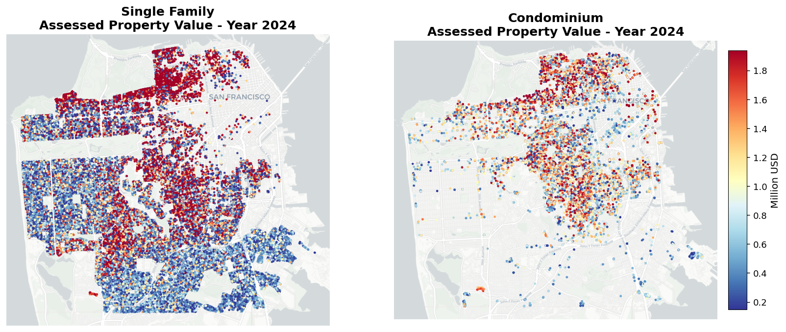
</p>

<p align="center"><em>Neighborhood-level geography of total assessed value for the two headline housing segments.</em></p>

### Observations

For **single-family homes**:

- **Presidio Heights** leads at **$4.729M**.
- **Hunters Point** sits at **$0.342M**.
- That is a spread of roughly **13.8x** within the same city.

For **condominiums**:

- **Presidio Heights** still leads, at **$1.605M**.
- The low end is **Mount Davidson Manor** at **$0.449M**.
- The spread is much narrower, about **3.6x**.

This difference is revealing. Single-family values combine:

- neighborhood prestige,
- lot size,
- structure size,
- and embedded scarcity.

Condo values are still highly unequal, but their narrower spread suggests a stronger role for:

- location,
- building typology,
- and urban access rather than lot scale.

### Tables


<details>
<summary><strong>Single-family neighborhoods with the highest 2024 median assessed value</strong></summary>

<table>
<caption>Single-family neighborhoods with the highest 2024 median assessed value</caption>
<thead>
<tr>
<th> </th>
<th>Median assessed value (USD millions)</th>
<th>Property count</th>
</tr>
<tr>
<th>assessor_neighborhood</th>
<th> </th>
<th> </th>
</tr>
</thead>
<tbody>
<tr>
<th>7C Presidio Heights</th>
<td>$4.729M</td>
<td>553</td>
</tr>
<tr>
<th>7B Pacific Heights</th>
<td>$4.160M</td>
<td>1,032</td>
</tr>
<tr>
<th>7D Cow Hollow</th>
<td>$2.542M</td>
<td>474</td>
</tr>
<tr>
<th>1F Sea Cliff</th>
<td>$2.433M</td>
<td>466</td>
</tr>
<tr>
<th>7A Marina</th>
<td>$2.274M</td>
<td>638</td>
</tr>
<tr>
<th>8E Russian Hill</th>
<td>$2.062M</td>
<td>322</td>
</tr>
<tr>
<th>5H Clarendon Heights</th>
<td>$2.049M</td>
<td>288</td>
</tr>
<tr>
<th>8G Telegraph Hill</th>
<td>$1.972M</td>
<td>106</td>
</tr>
<tr>
<th>5F Buena Vista Park/Ashbury Heights</th>
<td>$1.896M</td>
<td>442</td>
</tr>
<tr>
<th>6C Lower Pacific Heights</th>
<td>$1.786M</td>
<td>345</td>
</tr>
</tbody>
</table>

</details>


<details>
<summary><strong>Single-family neighborhoods with the lowest 2024 median assessed value</strong></summary>

<table>
<caption>Single-family neighborhoods with the lowest 2024 median assessed value</caption>
<thead>
<tr>
<th> </th>
<th>Median assessed value (USD millions)</th>
<th>Property count</th>
</tr>
<tr>
<th>assessor_neighborhood</th>
<th> </th>
<th> </th>
</tr>
</thead>
<tbody>
<tr>
<th>10J Hunters Point</th>
<td>$0.342M</td>
<td>146</td>
</tr>
<tr>
<th>10E Visitacion Valley</th>
<td>$0.411M</td>
<td>3,250</td>
</tr>
<tr>
<th>10K Bayview Heights</th>
<td>$0.435M</td>
<td>551</td>
</tr>
<tr>
<th>10G Silver Terrace</th>
<td>$0.442M</td>
<td>1,935</td>
</tr>
<tr>
<th>10A Bayview</th>
<td>$0.445M</td>
<td>2,732</td>
</tr>
<tr>
<th>10C Excelsior</th>
<td>$0.450M</td>
<td>4,643</td>
</tr>
<tr>
<th>3H Ingleside</th>
<td>$0.453M</td>
<td>1,815</td>
</tr>
<tr>
<th>10N Little Hollywood</th>
<td>$0.455M</td>
<td>399</td>
</tr>
<tr>
<th>10B Croker Amazon</th>
<td>$0.464M</td>
<td>2,521</td>
</tr>
<tr>
<th>10F Portola</th>
<td>$0.478M</td>
<td>3,814</td>
</tr>
</tbody>
</table>

</details>


<details>
<summary><strong>Condominium neighborhoods with the highest 2024 median assessed value</strong></summary>

<table>
<caption>Condominium neighborhoods with the highest 2024 median assessed value</caption>
<thead>
<tr>
<th> </th>
<th>Median assessed value (USD millions)</th>
<th>Property count</th>
</tr>
<tr>
<th>assessor_neighborhood</th>
<th> </th>
<th> </th>
</tr>
</thead>
<tbody>
<tr>
<th>7C Presidio Heights</th>
<td>$1.605M</td>
<td>339</td>
</tr>
<tr>
<th>3D Stonestown</th>
<td>$1.420M</td>
<td>122</td>
</tr>
<tr>
<th>7D Cow Hollow</th>
<td>$1.200M</td>
<td>1,056</td>
</tr>
<tr>
<th>9B Financial District South</th>
<td>$1.174M</td>
<td>2,438</td>
</tr>
<tr>
<th>1C Jordan Park/Laurel Heights</th>
<td>$1.167M</td>
<td>239</td>
</tr>
<tr>
<th>7A Marina</th>
<td>$1.138M</td>
<td>1,111</td>
</tr>
<tr>
<th>7B Pacific Heights</th>
<td>$1.136M</td>
<td>2,786</td>
</tr>
<tr>
<th>9H South Beach</th>
<td>$1.127M</td>
<td>3,671</td>
</tr>
<tr>
<th>8E Russian Hill</th>
<td>$1.098M</td>
<td>1,617</td>
</tr>
<tr>
<th>5G Corona Heights</th>
<td>$1.093M</td>
<td>533</td>
</tr>
</tbody>
</table>

</details>


<details>
<summary><strong>Condominium neighborhoods with the lowest 2024 median assessed value</strong></summary>

<table>
<caption>Condominium neighborhoods with the lowest 2024 median assessed value</caption>
<thead>
<tr>
<th> </th>
<th>Median assessed value (USD millions)</th>
<th>Property count</th>
</tr>
<tr>
<th>assessor_neighborhood</th>
<th> </th>
<th> </th>
</tr>
</thead>
<tbody>
<tr>
<th>4N Mount Davidson Manor</th>
<td>$0.449M</td>
<td>129</td>
</tr>
<tr>
<th>10B Croker Amazon</th>
<td>$0.467M</td>
<td>242</td>
</tr>
<tr>
<th>8J Tenderloin</th>
<td>$0.522M</td>
<td>406</td>
</tr>
<tr>
<th>4B Diamond Heights</th>
<td>$0.547M</td>
<td>668</td>
</tr>
<tr>
<th>3G Ingleside Heights</th>
<td>$0.587M</td>
<td>368</td>
</tr>
<tr>
<th>8A Downtown</th>
<td>$0.594M</td>
<td>1,201</td>
</tr>
<tr>
<th>10A Bayview</th>
<td>$0.601M</td>
<td>215</td>
</tr>
<tr>
<th>10J Hunters Point</th>
<td>$0.609M</td>
<td>581</td>
</tr>
<tr>
<th>8H North Waterfront</th>
<td>$0.629M</td>
<td>559</td>
</tr>
<tr>
<th>2C Outer Sunset</th>
<td>$0.645M</td>
<td>117</td>
</tr>
</tbody>
</table>

</details>


---

## Section 5B. What about assessed value per square foot?

Total assessed value is partly a size story. To separate size from value intensity, the notebook turns to **assessed value per square foot**.

This is not the same as observed market sale price per square foot, but it is highly informative because it distinguishes:

- neighborhoods where homes are valuable mainly because they are **large**, and
- neighborhoods where each unit of housing space is itself **highly valued**.

### Figure 6. Assessed value per square foot maps

<p align="center">
  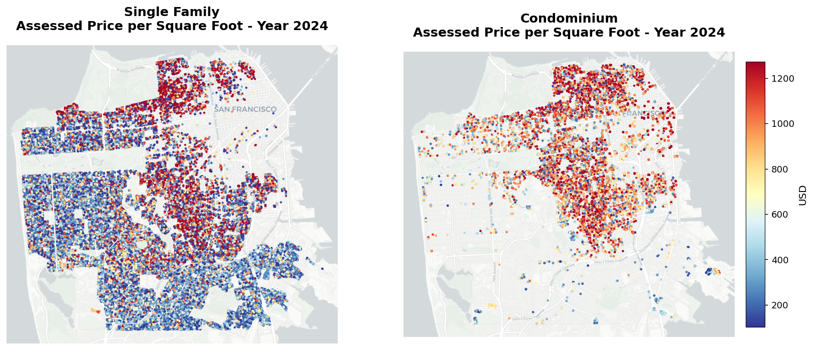
</p>

<p align="center"><em>Spatial pattern of value intensity after normalizing for interior area.</em></p>

### Observations

For **single-family homes**:

- The most expensive space appears in **Telegraph Hill ($1,199/sq ft)**, **Pacific Heights ($1,167/sq ft)**, and **Presidio Heights ($1,134/sq ft)**.
- The low end is concentrated in the southeast: **Hunters Point ($253/sq ft)**, **Bayview ($305/sq ft)**, and **Visitacion Valley ($322/sq ft)**.

For **condominiums**:

- The top tier is distinctly downtown and redevelopment oriented: **Financial District South ($1,145/sq ft)**, **Central Waterfront / Dogpatch ($1,145/sq ft)**, **South Beach ($1,142/sq ft)**, and **Mission Bay ($1,047/sq ft)**.

This is a strong result. The condo market appears to price:

- access to employment,
- waterfront redevelopment,
- and dense amenity clusters

more directly than the single-family market does. The single-family market still prices prestige neighborhoods very highly, but its geography remains less exclusively downtown-oriented.

### Tables


<details>
<summary><strong>Single-family neighborhoods with the highest 2024 assessed value per square foot</strong></summary>

<table>
<caption>Single-family neighborhoods with the highest 2024 assessed value per square foot</caption>
<thead>
<tr>
<th> </th>
<th>Median assessed value per sq ft</th>
<th>Property count</th>
</tr>
<tr>
<th>assessor_neighborhood</th>
<th> </th>
<th> </th>
</tr>
</thead>
<tbody>
<tr>
<th>8G Telegraph Hill</th>
<td>$1,199 / sq ft</td>
<td>106</td>
</tr>
<tr>
<th>7B Pacific Heights</th>
<td>$1,167 / sq ft</td>
<td>1,032</td>
</tr>
<tr>
<th>7C Presidio Heights</th>
<td>$1,134 / sq ft</td>
<td>553</td>
</tr>
<tr>
<th>7D Cow Hollow</th>
<td>$1,089 / sq ft</td>
<td>474</td>
</tr>
<tr>
<th>8E Russian Hill</th>
<td>$1,060 / sq ft</td>
<td>322</td>
</tr>
<tr>
<th>6C Lower Pacific Heights</th>
<td>$932 / sq ft</td>
<td>345</td>
</tr>
<tr>
<th>7A Marina</th>
<td>$924 / sq ft</td>
<td>638</td>
</tr>
<tr>
<th>1F Sea Cliff</th>
<td>$864 / sq ft</td>
<td>466</td>
</tr>
<tr>
<th>5K Eureka Valley/Dolores Heights</th>
<td>$862 / sq ft</td>
<td>1,498</td>
</tr>
<tr>
<th>5F Buena Vista Park/Ashbury Heights</th>
<td>$841 / sq ft</td>
<td>442</td>
</tr>
</tbody>
</table>

</details>


<details>
<summary><strong>Single-family neighborhoods with the lowest 2024 assessed value per square foot</strong></summary>

<table>
<caption>Single-family neighborhoods with the lowest 2024 assessed value per square foot</caption>
<thead>
<tr>
<th> </th>
<th>Median assessed value per sq ft</th>
<th>Property count</th>
</tr>
<tr>
<th>assessor_neighborhood</th>
<th> </th>
<th> </th>
</tr>
</thead>
<tbody>
<tr>
<th>10J Hunters Point</th>
<td>$253 / sq ft</td>
<td>146</td>
</tr>
<tr>
<th>10A Bayview</th>
<td>$305 / sq ft</td>
<td>2,732</td>
</tr>
<tr>
<th>10N Little Hollywood</th>
<td>$317 / sq ft</td>
<td>399</td>
</tr>
<tr>
<th>10K Bayview Heights</th>
<td>$319 / sq ft</td>
<td>551</td>
</tr>
<tr>
<th>10E Visitacion Valley</th>
<td>$322 / sq ft</td>
<td>3,250</td>
</tr>
<tr>
<th>10B Croker Amazon</th>
<td>$329 / sq ft</td>
<td>2,521</td>
</tr>
<tr>
<th>10G Silver Terrace</th>
<td>$333 / sq ft</td>
<td>1,935</td>
</tr>
<tr>
<th>4B Diamond Heights</th>
<td>$334 / sq ft</td>
<td>475</td>
</tr>
<tr>
<th>1A Central Richmond</th>
<td>$336 / sq ft</td>
<td>2,228</td>
</tr>
<tr>
<th>10F Portola</th>
<td>$343 / sq ft</td>
<td>3,814</td>
</tr>
</tbody>
</table>

</details>


<details>
<summary><strong>Condominium neighborhoods with the highest 2024 assessed value per square foot</strong></summary>

<table>
<caption>Condominium neighborhoods with the highest 2024 assessed value per square foot</caption>
<thead>
<tr>
<th> </th>
<th>Median assessed value per sq ft</th>
<th>Property count</th>
</tr>
<tr>
<th>assessor_neighborhood</th>
<th> </th>
<th> </th>
</tr>
</thead>
<tbody>
<tr>
<th>9B Financial District South</th>
<td>$1,145 / sq ft</td>
<td>2,438</td>
</tr>
<tr>
<th>9J Central Waterfront/Dogpatch</th>
<td>$1,145 / sq ft</td>
<td>715</td>
</tr>
<tr>
<th>9H South Beach</th>
<td>$1,142 / sq ft</td>
<td>3,671</td>
</tr>
<tr>
<th>7A Marina</th>
<td>$1,096 / sq ft</td>
<td>1,111</td>
</tr>
<tr>
<th>7D Cow Hollow</th>
<td>$1,092 / sq ft</td>
<td>1,056</td>
</tr>
<tr>
<th>9K Yerba Buena</th>
<td>$1,088 / sq ft</td>
<td>836</td>
</tr>
<tr>
<th>9D Mission Bay</th>
<td>$1,047 / sq ft</td>
<td>2,223</td>
</tr>
<tr>
<th>8E Russian Hill</th>
<td>$1,034 / sq ft</td>
<td>1,617</td>
</tr>
<tr>
<th>7C Presidio Heights</th>
<td>$1,033 / sq ft</td>
<td>339</td>
</tr>
<tr>
<th>6B Hayes Valley</th>
<td>$1,028 / sq ft</td>
<td>1,839</td>
</tr>
</tbody>
</table>

</details>


<details>
<summary><strong>Condominium neighborhoods with the lowest 2024 assessed value per square foot</strong></summary>

<table>
<caption>Condominium neighborhoods with the lowest 2024 assessed value per square foot</caption>
<thead>
<tr>
<th> </th>
<th>Median assessed value per sq ft</th>
<th>Property count</th>
</tr>
<tr>
<th>assessor_neighborhood</th>
<th> </th>
<th> </th>
</tr>
</thead>
<tbody>
<tr>
<th>4N Mount Davidson Manor</th>
<td>$355 / sq ft</td>
<td>129</td>
</tr>
<tr>
<th>10B Croker Amazon</th>
<td>$440 / sq ft</td>
<td>242</td>
</tr>
<tr>
<th>3A Lake Shore</th>
<td>$451 / sq ft</td>
<td>200</td>
</tr>
<tr>
<th>2C Outer Sunset</th>
<td>$559 / sq ft</td>
<td>117</td>
</tr>
<tr>
<th>10A Bayview</th>
<td>$569 / sq ft</td>
<td>215</td>
</tr>
<tr>
<th>2E Central Sunset</th>
<td>$580 / sq ft</td>
<td>158</td>
</tr>
<tr>
<th>1E Outer Richmond</th>
<td>$582 / sq ft</td>
<td>517</td>
</tr>
<tr>
<th>4B Diamond Heights</th>
<td>$649 / sq ft</td>
<td>668</td>
</tr>
<tr>
<th>10M Candlestick Point</th>
<td>$656 / sq ft</td>
<td>375</td>
</tr>
<tr>
<th>10J Hunters Point</th>
<td>$661 / sq ft</td>
<td>581</td>
</tr>
</tbody>
</table>

</details>


---

## Section 5C. How old are the buildings?

Building age adds a structural time dimension. It can proxy for:

- development era,
- redevelopment pressure,
- preservation,
- prestige,
- functional obsolescence,
- and the degree to which housing stock is a legacy inheritance versus a newer supply wave.

### Figure 7. Building-age maps

<p align="center">
  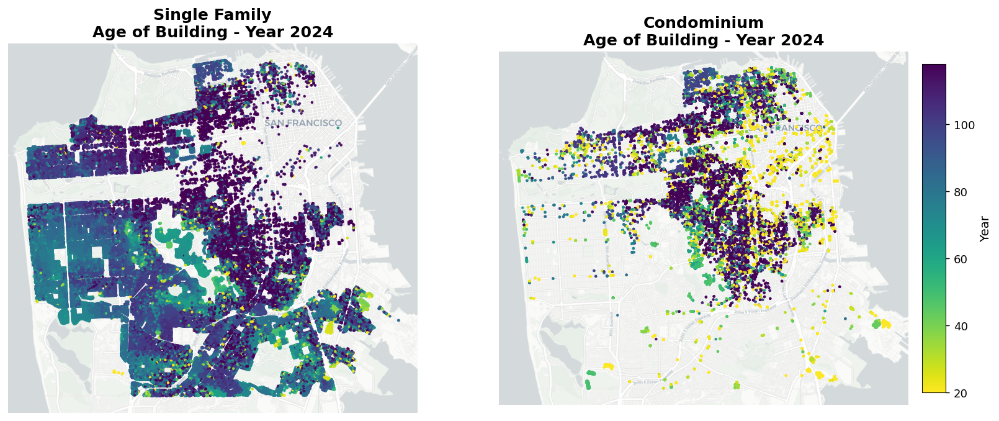
</p>

<p align="center"><em>Neighborhood geography of median building age for single-family homes and condos.</em></p>

### Observations

For **single-family housing**:

- The oldest neighborhoods in the table—**Lower Pacific Heights, Hayes Valley, North Panhandle, Inner Mission, and Haight Ashbury**—cluster around a median age of **124 years**.
- The youngest single-family neighborhood in the filtered table is **Hunters Point** at **36 years**, followed by **Diamond Heights (59 years)** and **Forest Knolls (63 years)**.

For **condominiums**:

- The youngest stock is concentrated in redevelopment districts:
  - **Hunters Point (8 years)**
  - **Stonestown (9 years)**
  - **Central Waterfront / Dogpatch (12 years)**
  - **Financial District South (15 years)**
  - **Mission Bay (15 years)**

This contrast is one of the report's most durable findings:

> **The condo stock is much more intertwined with post-2000 redevelopment, while the single-family stock is predominantly older and much slower-changing.**

That age difference later lines up closely with turnover, ownership, and market-circulation results.

### Tables


<details>
<summary><strong>Oldest single-family neighborhoods in the 2024 roll</strong></summary>

<table>
<caption>Oldest single-family neighborhoods in the 2024 roll</caption>
<thead>
<tr>
<th> </th>
<th>Median building age</th>
<th>Property count</th>
</tr>
<tr>
<th>assessor_neighborhood</th>
<th> </th>
<th> </th>
</tr>
</thead>
<tbody>
<tr>
<th>6C Lower Pacific Heights</th>
<td>124 years</td>
<td>345</td>
</tr>
<tr>
<th>6B Hayes Valley</th>
<td>124 years</td>
<td>221</td>
</tr>
<tr>
<th>6F North Panhandle</th>
<td>124 years</td>
<td>144</td>
</tr>
<tr>
<th>9C Inner Mission</th>
<td>124 years</td>
<td>1,064</td>
</tr>
<tr>
<th>5B Haight Ashbury</th>
<td>124 years</td>
<td>133</td>
</tr>
<tr>
<th>7B Pacific Heights</th>
<td>118 years</td>
<td>1,032</td>
</tr>
<tr>
<th>8G Telegraph Hill</th>
<td>117 years</td>
<td>106</td>
</tr>
<tr>
<th>5C Noe Valley</th>
<td>116 years</td>
<td>2,825</td>
</tr>
<tr>
<th>5K Eureka Valley/Dolores Heights</th>
<td>116 years</td>
<td>1,498</td>
</tr>
<tr>
<th>5F Buena Vista Park/Ashbury Heights</th>
<td>114 years</td>
<td>442</td>
</tr>
</tbody>
</table>

</details>


<details>
<summary><strong>Youngest single-family neighborhoods in the 2024 roll</strong></summary>

<table>
<caption>Youngest single-family neighborhoods in the 2024 roll</caption>
<thead>
<tr>
<th> </th>
<th>Median building age</th>
<th>Property count</th>
</tr>
<tr>
<th>assessor_neighborhood</th>
<th> </th>
<th> </th>
</tr>
</thead>
<tbody>
<tr>
<th>10J Hunters Point</th>
<td>36 years</td>
<td>146</td>
</tr>
<tr>
<th>4B Diamond Heights</th>
<td>59 years</td>
<td>475</td>
</tr>
<tr>
<th>4D Forest Knolls</th>
<td>63 years</td>
<td>475</td>
</tr>
<tr>
<th>4K Sherwood Forest</th>
<td>66 years</td>
<td>230</td>
</tr>
<tr>
<th>4F Midtown Terrace</th>
<td>67 years</td>
<td>975</td>
</tr>
<tr>
<th>5H Clarendon Heights</th>
<td>70 years</td>
<td>288</td>
</tr>
<tr>
<th>2A Golden Gate Heights</th>
<td>73 years</td>
<td>1,325</td>
</tr>
<tr>
<th>3A Lake Shore</th>
<td>74 years</td>
<td>1,135</td>
</tr>
<tr>
<th>6A Anza Vista</th>
<td>76 years</td>
<td>112</td>
</tr>
<tr>
<th>4H Miraloma Park</th>
<td>77 years</td>
<td>1,954</td>
</tr>
</tbody>
</table>

</details>


<details>
<summary><strong>Oldest condominium neighborhoods in the 2024 roll</strong></summary>

<table>
<caption>Oldest condominium neighborhoods in the 2024 roll</caption>
<thead>
<tr>
<th> </th>
<th>Median building age</th>
<th>Property count</th>
</tr>
<tr>
<th>assessor_neighborhood</th>
<th> </th>
<th> </th>
</tr>
</thead>
<tbody>
<tr>
<th>6E Alamo Square</th>
<td>124 years</td>
<td>292</td>
</tr>
<tr>
<th>5J Duboce Triangle</th>
<td>118 years</td>
<td>406</td>
</tr>
<tr>
<th>5B Haight Ashbury</th>
<td>117 years</td>
<td>667</td>
</tr>
<tr>
<th>7C Presidio Heights</th>
<td>115 years</td>
<td>339</td>
</tr>
<tr>
<th>5K Eureka Valley/Dolores Heights</th>
<td>113 years</td>
<td>1,470</td>
</tr>
<tr>
<th>5E Cole Valley/Parnassus Heights</th>
<td>112 years</td>
<td>632</td>
</tr>
<tr>
<th>6F North Panhandle</th>
<td>107 years</td>
<td>1,122</td>
</tr>
<tr>
<th>1D Lake Street</th>
<td>103 years</td>
<td>523</td>
</tr>
<tr>
<th>5C Noe Valley</th>
<td>99 years</td>
<td>1,752</td>
</tr>
<tr>
<th>7D Cow Hollow</th>
<td>98 years</td>
<td>1,056</td>
</tr>
</tbody>
</table>

</details>


<details>
<summary><strong>Youngest condominium neighborhoods in the 2024 roll</strong></summary>

<table>
<caption>Youngest condominium neighborhoods in the 2024 roll</caption>
<thead>
<tr>
<th> </th>
<th>Median building age</th>
<th>Property count</th>
</tr>
<tr>
<th>assessor_neighborhood</th>
<th> </th>
<th> </th>
</tr>
</thead>
<tbody>
<tr>
<th>10J Hunters Point</th>
<td>8 years</td>
<td>581</td>
</tr>
<tr>
<th>3D Stonestown</th>
<td>9 years</td>
<td>122</td>
</tr>
<tr>
<th>9J Central Waterfront/Dogpatch</th>
<td>12 years</td>
<td>715</td>
</tr>
<tr>
<th>10A Bayview</th>
<td>14 years</td>
<td>215</td>
</tr>
<tr>
<th>9B Financial District South</th>
<td>15 years</td>
<td>2,438</td>
</tr>
<tr>
<th>9D Mission Bay</th>
<td>15 years</td>
<td>2,223</td>
</tr>
<tr>
<th>10M Candlestick Point</th>
<td>17 years</td>
<td>375</td>
</tr>
<tr>
<th>9H South Beach</th>
<td>18 years</td>
<td>3,671</td>
</tr>
<tr>
<th>9F South of Market</th>
<td>20 years</td>
<td>1,886</td>
</tr>
<tr>
<th>8J Tenderloin</th>
<td>21 years</td>
<td>406</td>
</tr>
</tbody>
</table>

</details>


---

## Section 5D. Where are the recently sold homes?

Because Proposition 13 anchors many long-held assessments to old base-year values, the most market-relevant subset of the roll is often the housing that has sold recently.

This section isolates homes sold in the **last five years** and examines their 2024 assessed values. The goal is not to reconstruct transaction prices, but to narrow attention to properties whose assessments are more likely to be closer to current conditions.

### Figure 8. Recently sold homes in the last five years

<p align="center">
  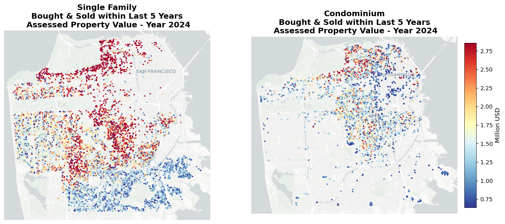
</p>

<p align="center"><em>Maps focused on the recent-sales subset, where assessor values are closer to current conditions.</em></p>

### Interpretation

This section is the bridge between static geography and active market structure. It shows which neighborhoods are not only valuable, but also **participating in current market exchange**. In a Proposition 13 context, this matters enormously: a neighborhood may be wealthy in the stock sense while still contributing only a small trickle of homes to the active market.

### Tables


<details>
<summary><strong>Single-family neighborhoods with the highest number of recent transactions</strong></summary>

<table>
<caption>Single-family neighborhoods with the highest number of recent transactions</caption>
<thead>
<tr>
<th> </th>
<th>Median assessed value (USD millions)</th>
<th>Recent transaction count</th>
</tr>
<tr>
<th>assessor_neighborhood</th>
<th> </th>
<th> </th>
</tr>
</thead>
<tbody>
<tr>
<th>9A Bernal Heights</th>
<td>$1.683M</td>
<td>589</td>
</tr>
<tr>
<th>5C Noe Valley</th>
<td>$2.679M</td>
<td>412</td>
</tr>
<tr>
<th>10C Excelsior</th>
<td>$1.171M</td>
<td>358</td>
</tr>
<tr>
<th>2D Parkside</th>
<td>$1.553M</td>
<td>353</td>
</tr>
<tr>
<th>2E Central Sunset</th>
<td>$1.665M</td>
<td>318</td>
</tr>
<tr>
<th>2B Outer Parkside</th>
<td>$1.486M</td>
<td>305</td>
</tr>
<tr>
<th>2C Outer Sunset</th>
<td>$1.559M</td>
<td>275</td>
</tr>
<tr>
<th>5A Glen Park</th>
<td>$1.925M</td>
<td>256</td>
</tr>
<tr>
<th>10A Bayview</th>
<td>$1.008M</td>
<td>237</td>
</tr>
<tr>
<th>10F Portola</th>
<td>$1.244M</td>
<td>236</td>
</tr>
</tbody>
</table>

</details>


<details>
<summary><strong>Condominium neighborhoods with the highest number of recent transactions</strong></summary>

<table>
<caption>Condominium neighborhoods with the highest number of recent transactions</caption>
<thead>
<tr>
<th> </th>
<th>Median assessed value (USD millions)</th>
<th>Recent transaction count</th>
</tr>
<tr>
<th>assessor_neighborhood</th>
<th> </th>
<th> </th>
</tr>
</thead>
<tbody>
<tr>
<th>9H South Beach</th>
<td>$1.395M</td>
<td>793</td>
</tr>
<tr>
<th>7B Pacific Heights</th>
<td>$1.558M</td>
<td>594</td>
</tr>
<tr>
<th>9C Inner Mission</th>
<td>$1.144M</td>
<td>491</td>
</tr>
<tr>
<th>8F Van Ness/ Civic Center</th>
<td>$0.815M</td>
<td>457</td>
</tr>
<tr>
<th>9D Mission Bay</th>
<td>$1.137M</td>
<td>447</td>
</tr>
<tr>
<th>9B Financial District South</th>
<td>$1.419M</td>
<td>428</td>
</tr>
<tr>
<th>6B Hayes Valley</th>
<td>$1.139M</td>
<td>398</td>
</tr>
<tr>
<th>5C Noe Valley</th>
<td>$1.561M</td>
<td>377</td>
</tr>
<tr>
<th>9F South of Market</th>
<td>$0.780M</td>
<td>371</td>
</tr>
<tr>
<th>8E Russian Hill</th>
<td>$1.438M</td>
<td>350</td>
</tr>
</tbody>
</table>

</details>


---

## Section 5E. Owner-occupied vs rental-oriented properties

This is one of the most important sections in the notebook.

It combines three lenses:

- the size of each housing stock,
- the recent turnover rate,
- and the share of homes that appear owner-occupied based on the homeowner exemption flag.

That combination allows the report to distinguish between:

- neighborhoods dominated by stable owner households,
- neighborhoods that appear more renter- or investor-facing,
- and segments that contribute disproportionately to current market flow.

### Core result: the Two Housing Circuits emerge here

The results show that San Francisco does **not** operate as one unified housing market. Instead, it behaves through **Two Housing Circuits**:

- a **legacy circuit** of tightly held homes; and
- a **circulation circuit** of homes that re-enter the market and absorb new demand.

### Key numerical findings

- The analysis set contains **94,844 single-family homes** and **52,042 condominiums**.
- The apparent owner-occupied share is **55.6%** for single-family homes but only **34.2%** for condos.
- That is a **21.4 percentage-point gap**, suggesting condos play a much larger renter- and investor-facing role.
- Recent turnover differs sharply:
  - **8,531 single-family homes** sold in the last five years (**9.0%** of stock)
  - **10,520 condos** sold in the last five years (**20.2%** of stock)
- So the condo stock turns over at **more than 2.2x** the single-family rate.
- Among recently purchased homes, only **27.8%** of single-family acquisitions and **24.0%** of condo acquisitions appear owner-occupied via exemption code 11.
- The remaining shares—**72.2%** for recently purchased single-family homes and **76.0%** for recently purchased condos—appear not owner-occupied.

### Why this matters

This section completely changes how the city's housing stock should be interpreted.

#### 1. Single-family homes dominate the stock, but not the active market

There are many more single-family homes overall, yet fewer of them transact over a five-year window than condos. That means headline stock counts and accessible market stock are telling different stories.

#### 2. Condominiums function as circulation housing

Even though condos are a much smaller stock, they generate more recent transactions and appear far more exposed to renter and investor demand. They are, in practical terms, carrying much more of the city's turnover burden.

#### 3. Single-family housing increasingly resembles legacy housing

A majority appears owner-occupied, turnover is low, and a large part of the stock sits outside the normal flow of market exchange. In other words, a substantial share of the city's single-family stock exists physically without functioning as active entry inventory.

### The most important insight in Section 5E

A particularly strong finding is that **recently transacted units in both property types look overwhelmingly non-owner-occupied after purchase**.

This pushes against a common simplified narrative:

- single-family homes are supposedly contested mainly by owner-occupiers;
- condos are supposedly the investor segment.

The evidence here suggests something more subtle and more consequential:

> **Once a home enters the circulation circuit, both single-family homes and condos appear to face a similar competitive environment. Investors and non-owner-occupying buyers are not confined to condos alone; they compete for both when those homes come onto the market.**

That means a household trying to buy into San Francisco is not just competing in a condo-only investor arena. It appears to face competition across the broader active market.

### Tables


<details>
<summary><strong>Occupancy and recent turnover by housing type</strong></summary>

<table>
<caption>Occupancy and recent turnover by housing type</caption>
<thead>
<tr>
<th> </th>
<th>Units in analysis</th>
<th>Owner-occupied units</th>
<th>Owner-occupied share</th>
<th>Units sold in last 5 years</th>
<th>5-year turnover rate</th>
</tr>
</thead>
<tbody>
<tr>
<th>Single-family</th>
<td>94,844</td>
<td>52,692</td>
<td>55.6%</td>
<td>8,531</td>
<td>9.0%</td>
</tr>
<tr>
<th>Condominium</th>
<td>52,042</td>
<td>17,800</td>
<td>34.2%</td>
<td>10,520</td>
<td>20.2%</td>
</tr>
</tbody>
</table>

</details>


<details>
<summary><strong>Occupancy mix among units purchased in the last 5 years</strong></summary>

<table>
<caption>Occupancy mix among units purchased in the last 5 years</caption>
<thead>
<tr>
<th> </th>
<th>Units sold in last 5 years</th>
<th>Recent purchases that are owner-occupied</th>
<th>Owner-occupied share among recent purchases</th>
<th>Recent purchases that appear renter-occupied</th>
<th>Renter-occupied share among recent purchases</th>
</tr>
</thead>
<tbody>
<tr>
<th>Single-family</th>
<td>8,531</td>
<td>2,370</td>
<td>27.8%</td>
<td>6,161</td>
<td>72.2%</td>
</tr>
<tr>
<th>Condominium</th>
<td>10,520</td>
<td>2,520</td>
<td>24.0%</td>
<td>8,000</td>
<td>76.0%</td>
</tr>
</tbody>
</table>

</details>


---

## Section 5F. Number of years since last sale

Section 5E introduces the Two Housing Circuits through ownership and recent turnover. Section 5F deepens the argument by asking the dynamic question:

> **How long do homes stay in the same ownership before returning to the market?**

This is where the distinction between **legacy stock** and **circulating stock** becomes especially visible.

### Figure 9. Years since last sale maps

<p align="center">
  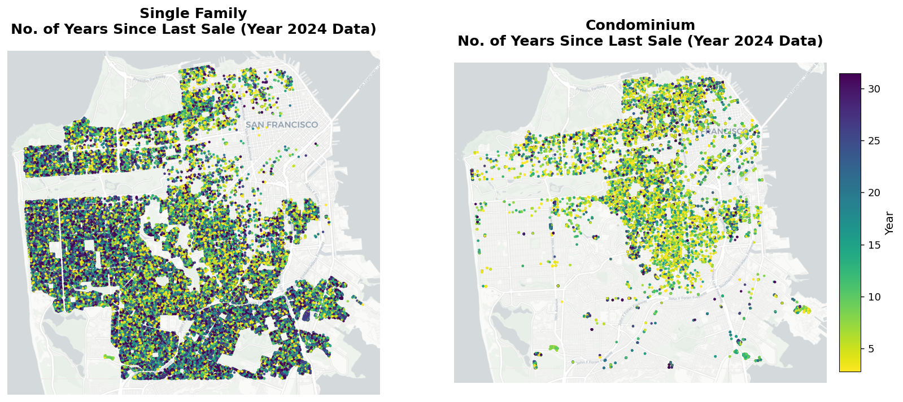
</p>

<p align="center"><em>Spatial turnover map showing how long each part of the city has held its housing stock.</em></p>

### Figure 10. 2024 holding-period histograms

<p align="center">
  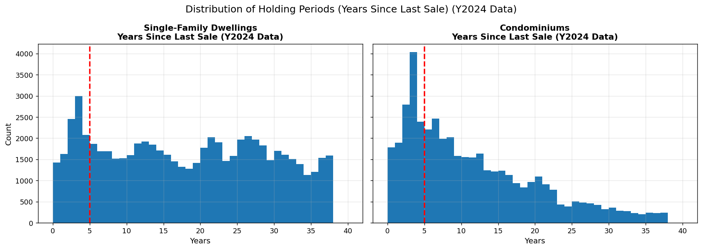
</p>

<p align="center"><em>Side-by-side distribution of years since last sale for single-family homes and condos in 2024.</em></p>

### Figure 11. 2019 holding-period histograms

<p align="center">
  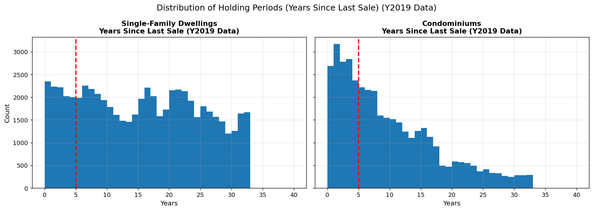
</p>

<p align="center"><em>Pre-pandemic comparison showing that the 2021 spike seen in 2024 is not the long-run norm.</em></p>

### Figure 12. Decay-function fit comparison

<p align="center">
  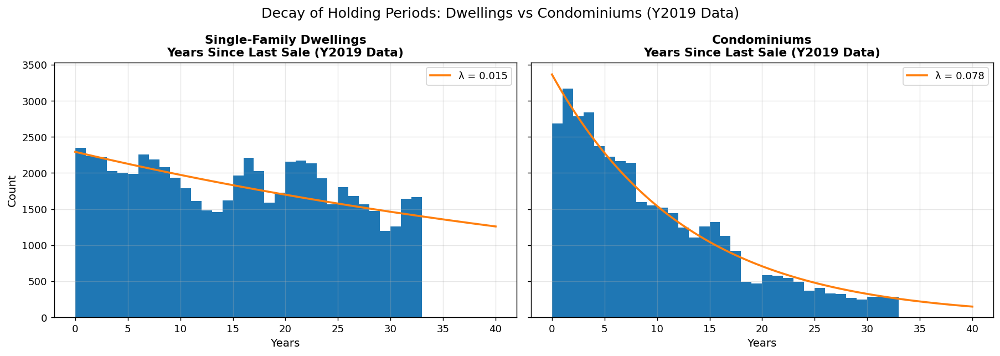
</p>

<p align="center"><em>Exponential decay fit illustrating a strong circulation pattern for condos and a weak fit for single-family homes.</em></p>

### Main observations from the holding-period figures

- In the **2024** holding-period figures, both housing types show a concentration around homes sold roughly **3 years earlier**, corresponding to the **2021** market.
- That spike is plausibly linked to the unusual pandemic housing cycle and should **not** be treated as the structural norm.
- The **2019** figures confirm this point, because the spike disappears there.
- The condo distribution looks much more like a **circulation market**:
  - many units sold recently,
  - counts fall away steadily as holding periods lengthen,
  - and the histogram resembles a clear time-dependent decay process.
- The single-family distribution does **not** behave that way nearly as cleanly.
  - Instead, it suggests a large stock of homes that remain in the same ownership for very long periods.
  - It looks less like churn-driven inventory and more like an embedded stock with weak recycling.

### Decay-function interpretation

The exponential decay fit captures not only how many homes sold recently, but how quickly ownership cohorts thin out as time passes.

For **condominiums**:

- fitted decay parameter: **λ = 0.078**
- intuitive interpretation: the count of condos remaining in a given “not sold since” cohort shrinks by about **7.8% per additional year** in exponential terms
- implied half-life: about **8.9 years**

This is strong evidence of a real **circulation circuit**. Condos behave like a housing segment that continually recycles through the market.

For **single-family homes**:

- fitted parameter: **λ = 0.015**
- implied notional half-life: about **46.2 years**
- but the fit is weak and should be interpreted cautiously

That weak fit is important in itself. It shows that single-family homes do **not** follow a clean market-churn process because a substantial share of the stock is not behaving like ordinary circulating inventory at all.

Instead, much of it behaves like **legacy housing**:

- long-held owner-occupied residences,
- or long-held rental assets retained over decades.

### Why the decay result matters

This is one of the strongest analytical links in the report.

It shows that:

- the condo market is not just **less owner-occupied**; it is also **structurally more recyclable**;
- the single-family market is not just **more owner-occupied**; it is also **structurally less liquid**, with a much larger long-duration holding component.

That leads to an important economic implication:

> **The real constraint is not simply how many homes exist. It is how many homes are actually circulating.**

In a city where prices are set at the margin, this matters enormously. The circulation stock—rather than the full physical stock—is where price discovery, entry competition, and investor pressure are concentrated.

### Broader civic interpretation

Section 5F also points to a deeper civic balance.

- The **legacy circuit** preserves rootedness, continuity, and neighborhood memory.
- The **circulation circuit** enables entry, adaptation, and demographic renewal.

A vibrant city needs both. But if too much of the stock remains locked in the legacy circuit, the city becomes increasingly hard for newcomers to enter. If the circulation circuit becomes too investor-oriented, access remains available mainly as a rental or investment channel rather than as long-term ownership opportunity.

---

# Final interpretation

Taken together, the notebook is best understood through the framework of **Two Housing Circuits**.

## The legacy housing circuit

This consists of homes that are:

- older,
- tightly held,
- often owner-occupied or long-term retained,
- slow to re-enter the market,
- and structurally important to neighborhood continuity.

## The circulation housing circuit

This consists of homes that:

- turn over more frequently,
- absorb new demand,
- play a disproportionate role in price discovery,
- and determine who can still enter the city as a homeowner.

This framework connects the report's maps, neighborhood rankings, age patterns, turnover summaries, and decay fits into one coherent structural interpretation.

---

## Final synthesis of the seven major conclusions

### 1. The city's value geography is highly unequal

Even within the same property type, the spread between expensive and affordable neighborhoods is enormous.

- Single-family median assessed value ranges from about **$4.729M in Presidio Heights** to **$0.342M in Hunters Point**.
- On a per-square-foot basis, single-family values range from about **$1,199/sq ft in Telegraph Hill** to **$253/sq ft in Hunters Point**.

These are not minor deviations around a citywide average. They reflect distinct submarkets shaped by prestige, land scarcity, urban history, redevelopment, and transaction patterns.

### 2. Single-family homes and condos serve different structural roles

Across the report, the contrast repeats again and again:

- **Age:** many single-family neighborhoods are around or above a century old, while the youngest condo districts measure in single digits to the teens.
- **Turnover:** condos show a **20.2%** five-year turnover rate versus **9.0%** for single-family homes.
- **Occupancy:** apparent owner occupancy is **55.6%** for single-family homes and **34.2%** for condos.
- **Recent-purchase outcomes:** only **27.8%** of recently purchased single-family homes and **24.0%** of recently purchased condos appear owner-occupied.
- **Holding periods:** condos show a clear circulation pattern with **λ = 0.078** and an implied half-life of **8.9 years**, while single-family homes show a weak, flatter pattern with **λ = 0.015** and a notional half-life of **46.2 years**.

All of this strongly supports the Two Housing Circuits interpretation. Single-family homes behave much more like the **legacy circuit**. Condos behave much more like the **circulation circuit**.

### 3. The active market is much smaller than the total stock

This may be the single most important conclusion in the report.

San Francisco contains about **94,844** single-family homes, yet only **8,531** sold in the last five years. Meanwhile, a much smaller condo stock of **52,042** units generated **10,520** sales over the same period.

So the homes actually setting prices and absorbing new demand come from a much thinner pool than gross stock numbers suggest. The real battleground for entry is the **circulation circuit**, not the full housing stock.

### 4. Investor-oriented outcomes appear in both property types

A particularly important result is that recently transacted units in **both** segments appear overwhelmingly outside the owner-occupied category after purchase.

This suggests that investor or non-owner-occupying demand is not confined to condos. Once a home enters the circulation market, both single-family homes and condos appear to face a similar competitive environment.

That is a more nuanced—and more sobering—result than the familiar narrative that condos are the investor segment while single-family homes are protected for household buyers.

### 5. Proposition 13 and long holding periods shape the assessor data

Assessment values in California reflect ownership history as much as current market conditions. Long-held properties may carry values far below current market levels, while recent sales are much closer to contemporary conditions.

That institutional structure is not a side note. It is part of the market itself. It explains why recent-sales filtering is so informative and why a large part of the stock behaves like legacy housing.

### 6. The deeper civic tension is continuity versus renewal

The report ultimately points beyond prices alone.

- The **legacy circuit** preserves continuity, memory, and long-term rootedness.
- The **circulation circuit** enables entry, adaptation, and demographic renewal.

A healthy city needs both. But when the legacy circuit becomes too dominant, the city can become closed to newcomers. When the circulation circuit becomes too investor-oriented, the city can remain active as a rental or investment market while becoming less attainable as a place for long-term ownership and household formation.

### 7. Final takeaway

San Francisco's housing challenge is not only a shortage of homes in the abstract.

It is also a shortage of homes that are meaningfully:

- **available**,
- **circulating**,
- and **accessible** to new owner-occupants.

That is the core lesson of the notebook. The city does not simply contain expensive housing. It contains a large legacy stock that turns over slowly, alongside a much smaller circulation stock that bears most of the pressure of entry, investment demand, and price discovery. Understanding that distinction is essential for interpreting affordability, neighborhood change, and the long-run vitality of the city.

---

## Full table appendix

Below are the remaining report tables, included for completeness and GitHub portability.

### Property structure tables


<details>
<summary><strong>Property type codes appearing in the assessor roll</strong></summary>

<table>
<caption>Property type codes appearing in the assessor roll</caption>
<thead>
<tr>
<th> </th>
<th>Use Code</th>
<th>Property Type Description</th>
</tr>
</thead>
<tbody>
<tr>
<th>0</th>
<td>SRES</td>
<td>Single Family Residential</td>
</tr>
<tr>
<th>1</th>
<td>MRES</td>
<td>Multi-Family Residential</td>
</tr>
<tr>
<th>2</th>
<td>MISC</td>
<td>Miscellaneous/Mixed-Use</td>
</tr>
<tr>
<th>3</th>
<td>IND</td>
<td>Industrial</td>
</tr>
<tr>
<th>4</th>
<td>GOVT</td>
<td>Government</td>
</tr>
<tr>
<th>5</th>
<td>COMR</td>
<td>Commercial Retail</td>
</tr>
<tr>
<th>6</th>
<td>COMO</td>
<td>Commercial Office</td>
</tr>
<tr>
<th>7</th>
<td>COMM</td>
<td>Commercial Misc</td>
</tr>
<tr>
<th>8</th>
<td>COMH</td>
<td>Commercial Hotel</td>
</tr>
</tbody>
</table>

</details>


<details>
<summary><strong>Top 5 neighborhoods by property count within each property type</strong></summary>

<table>
<caption>Top 5 neighborhoods by property count within each property type</caption>
<thead>
<tr>
<th>Property Type</th>
<th>1 Single Family (SRES)</th>
<th>2 Multi Family (MRES)</th>
<th>3 Retail (COMR)</th>
<th>4 Office (COMO)</th>
<th>5 Hotel (COMH)</th>
<th>6 Timeshare (COMM)</th>
<th>7 Industrial (IND)</th>
<th>8 Vacant Gov (GOVT)</th>
<th>9 Vacant Public (MISC)</th>
</tr>
<tr>
<th>Rank</th>
<th> </th>
<th> </th>
<th> </th>
<th> </th>
<th> </th>
<th> </th>
<th> </th>
<th> </th>
<th> </th>
</tr>
</thead>
<tbody>
<tr>
<th>1</th>
<td>9A Bernal Heights</td>
<td>9C Inner Mission</td>
<td>9C Inner Mission</td>
<td>8B Financial District North</td>
<td>8B Financial District North</td>
<td>8A Downtown</td>
<td>10A Bayview</td>
<td>9I Treasure Isl./Yerba Buena Isl.</td>
<td>10M Candlestick Point</td>
</tr>
<tr>
<th>2</th>
<td>2D Parkside</td>
<td>1A Central Richmond</td>
<td>8B Financial District North</td>
<td>8I Union Square</td>
<td>8J Tenderloin</td>
<td>6B Hayes Valley</td>
<td>9F South of Market</td>
<td>10J Hunters Point</td>
<td>10A Bayview</td>
</tr>
<tr>
<th>3</th>
<td>2E Central Sunset</td>
<td>5C Noe Valley</td>
<td>9F South of Market</td>
<td>9F South of Market</td>
<td>9F South of Market</td>
<td>8E Russian Hill</td>
<td>9C Inner Mission</td>
<td>10A Bayview</td>
<td>9A Bernal Heights</td>
</tr>
<tr>
<th>4</th>
<td>9H South Beach</td>
<td>1B Inner Richmond</td>
<td>8I Union Square</td>
<td>9B Financial District South</td>
<td>8A Downtown</td>
<td>9C Inner Mission</td>
<td>9E Potrero Hill</td>
<td>9J Central Waterfront/Dogpatch</td>
<td>10J Hunters Point</td>
</tr>
<tr>
<th>5</th>
<td>10C Excelsior</td>
<td>2F Inner Sunset</td>
<td>6C Lower Pacific Heights</td>
<td>8F Van Ness/ Civic Center</td>
<td>8I Union Square</td>
<td>8F Van Ness/ Civic Center</td>
<td>9J Central Waterfront/Dogpatch</td>
<td>9D Mission Bay</td>
<td>10D Outer Mission</td>
</tr>
</tbody>
</table>

</details>


<details>
<summary><strong>Property counts by type and roll year</strong></summary>

<table>
<caption>Property counts by type and roll year</caption>
<thead>
<tr>
<th>use_code</th>
<th>Roll Year</th>
<th>1 Single Family (SRES)</th>
<th>2 Multi Family (MRES)</th>
<th>3 Retail (COMR)</th>
<th>4 Office (COMO)</th>
<th>5 Hotel (COMH)</th>
<th>6 Timeshare (COMM)</th>
<th>7 Industrial (IND)</th>
<th>8 Vacant Gov (GOVT)</th>
<th>9 Vacant Public (MISC)</th>
</tr>
</thead>
<tbody>
<tr>
<th>0</th>
<td>2007</td>
<td>135,285</td>
<td>37,941</td>
<td>3,703</td>
<td>1,570</td>
<td>746</td>
<td>9,209</td>
<td>2,406</td>
<td>642</td>
<td>6,104</td>
</tr>
<tr>
<th>1</th>
<td>2008</td>
<td>137,685</td>
<td>37,641</td>
<td>3,766</td>
<td>1,518</td>
<td>741</td>
<td>9,482</td>
<td>2,419</td>
<td>642</td>
<td>6,116</td>
</tr>
<tr>
<th>2</th>
<td>2009</td>
<td>138,894</td>
<td>37,313</td>
<td>3,833</td>
<td>1,493</td>
<td>739</td>
<td>9,380</td>
<td>2,411</td>
<td>638</td>
<td>6,044</td>
</tr>
<tr>
<th>3</th>
<td>2010</td>
<td>140,514</td>
<td>37,674</td>
<td>3,765</td>
<td>1,523</td>
<td>738</td>
<td>9,697</td>
<td>2,397</td>
<td>627</td>
<td>5,993</td>
</tr>
<tr>
<th>4</th>
<td>2011</td>
<td>132,843</td>
<td>36,906</td>
<td>3,767</td>
<td>1,520</td>
<td>740</td>
<td>9,595</td>
<td>2,379</td>
<td>360</td>
<td>5,603</td>
</tr>
<tr>
<th>5</th>
<td>2012</td>
<td>142,250</td>
<td>37,000</td>
<td>3,830</td>
<td>1,544</td>
<td>740</td>
<td>9,658</td>
<td>2,378</td>
<td>621</td>
<td>5,980</td>
</tr>
<tr>
<th>6</th>
<td>2013</td>
<td>143,707</td>
<td>36,766</td>
<td>3,877</td>
<td>1,579</td>
<td>743</td>
<td>9,645</td>
<td>2,377</td>
<td>625</td>
<td>6,069</td>
</tr>
<tr>
<th>7</th>
<td>2014</td>
<td>144,987</td>
<td>36,518</td>
<td>3,917</td>
<td>1,587</td>
<td>740</td>
<td>9,642</td>
<td>2,390</td>
<td>700</td>
<td>5,811</td>
</tr>
<tr>
<th>8</th>
<td>2015</td>
<td>146,447</td>
<td>37,614</td>
<td>3,982</td>
<td>1,612</td>
<td>742</td>
<td>9,367</td>
<td>2,340</td>
<td>779</td>
<td>5,862</td>
</tr>
<tr>
<th>9</th>
<td>2016</td>
<td>147,881</td>
<td>38,099</td>
<td>4,000</td>
<td>1,640</td>
<td>744</td>
<td>9,365</td>
<td>2,321</td>
<td>779</td>
<td>5,721</td>
</tr>
<tr>
<th>10</th>
<td>2017</td>
<td>147,863</td>
<td>37,857</td>
<td>3,995</td>
<td>1,634</td>
<td>743</td>
<td>7,063</td>
<td>2,311</td>
<td>766</td>
<td>5,628</td>
</tr>
<tr>
<th>11</th>
<td>2018</td>
<td>150,608</td>
<td>37,220</td>
<td>3,981</td>
<td>1,648</td>
<td>756</td>
<td>9,363</td>
<td>2,245</td>
<td>912</td>
<td>5,863</td>
</tr>
<tr>
<th>12</th>
<td>2019</td>
<td>151,720</td>
<td>36,829</td>
<td>3,990</td>
<td>1,667</td>
<td>754</td>
<td>9,354</td>
<td>2,230</td>
<td>916</td>
<td>5,889</td>
</tr>
<tr>
<th>13</th>
<td>2020</td>
<td>151,706</td>
<td>36,720</td>
<td>3,982</td>
<td>1,667</td>
<td>754</td>
<td>5,706</td>
<td>2,226</td>
<td>900</td>
<td>5,857</td>
</tr>
<tr>
<th>14</th>
<td>2021</td>
<td>153,042</td>
<td>36,514</td>
<td>4,003</td>
<td>1,667</td>
<td>749</td>
<td>5,695</td>
<td>2,208</td>
<td>864</td>
<td>5,776</td>
</tr>
<tr>
<th>15</th>
<td>2022</td>
<td>153,731</td>
<td>36,463</td>
<td>4,322</td>
<td>1,823</td>
<td>761</td>
<td>5,911</td>
<td>2,388</td>
<td>314</td>
<td>5,633</td>
</tr>
<tr>
<th>16</th>
<td>2023</td>
<td>154,421</td>
<td>36,375</td>
<td>4,347</td>
<td>1,824</td>
<td>763</td>
<td>5,897</td>
<td>2,377</td>
<td>346</td>
<td>5,468</td>
</tr>
<tr>
<th>17</th>
<td>2024</td>
<td>154,886</td>
<td>36,320</td>
<td>4,367</td>
<td>1,819</td>
<td>753</td>
<td>5,901</td>
<td>2,370</td>
<td>344</td>
<td>5,452</td>
</tr>
</tbody>
</table>

</details>


<details>
<summary><strong>Median assessed value by property type and roll year</strong></summary>

<table>
<caption>Median assessed value by property type and roll year</caption>
<thead>
<tr>
<th>use_code</th>
<th>Roll Year</th>
<th>1 Single Family (SRES)</th>
<th>2 Multi Family (MRES)</th>
<th>3 Retail (COMR)</th>
<th>4 Office (COMO)</th>
<th>5 Hotel (COMH)</th>
<th>6 Timeshare (COMM)</th>
<th>7 Industrial (IND)</th>
<th>8 Vacant Gov (GOVT)</th>
<th>9 Vacant Public (MISC)</th>
</tr>
</thead>
<tbody>
<tr>
<th>0</th>
<td>2007</td>
<td>$0.316M</td>
<td>$0.426M</td>
<td>$0.474M</td>
<td>$1.079M</td>
<td>$1.218M</td>
<td>$0.006M</td>
<td>$0.421M</td>
<td>$0.000M</td>
<td>$0.001M</td>
</tr>
<tr>
<th>1</th>
<td>2008</td>
<td>$0.342M</td>
<td>$0.449M</td>
<td>$0.502M</td>
<td>$1.233M</td>
<td>$1.279M</td>
<td>$0.005M</td>
<td>$0.464M</td>
<td>$0.000M</td>
<td>$0.001M</td>
</tr>
<tr>
<th>2</th>
<td>2009</td>
<td>$0.363M</td>
<td>$0.469M</td>
<td>$0.511M</td>
<td>$1.322M</td>
<td>$1.327M</td>
<td>$0.004M</td>
<td>$0.492M</td>
<td>$0.000M</td>
<td>$0.001M</td>
</tr>
<tr>
<th>3</th>
<td>2010</td>
<td>$0.368M</td>
<td>$0.470M</td>
<td>$0.534M</td>
<td>$1.361M</td>
<td>$1.373M</td>
<td>$0.004M</td>
<td>$0.499M</td>
<td>$0.000M</td>
<td>$0.001M</td>
</tr>
<tr>
<th>4</th>
<td>2011</td>
<td>$0.382M</td>
<td>$0.487M</td>
<td>$0.535M</td>
<td>$1.433M</td>
<td>$1.376M</td>
<td>$0.004M</td>
<td>$0.519M</td>
<td>$0.000M</td>
<td>$0.001M</td>
</tr>
<tr>
<th>5</th>
<td>2012</td>
<td>$0.400M</td>
<td>$0.513M</td>
<td>$0.560M</td>
<td>$1.492M</td>
<td>$1.464M</td>
<td>$0.003M</td>
<td>$0.546M</td>
<td>$0.000M</td>
<td>$0.001M</td>
</tr>
<tr>
<th>6</th>
<td>2013</td>
<td>$0.421M</td>
<td>$0.538M</td>
<td>$0.563M</td>
<td>$1.517M</td>
<td>$1.513M</td>
<td>$0.003M</td>
<td>$0.560M</td>
<td>$0.000M</td>
<td>$0.001M</td>
</tr>
<tr>
<th>7</th>
<td>2015</td>
<td>$0.468M</td>
<td>$0.570M</td>
<td>$0.600M</td>
<td>$1.614M</td>
<td>$1.567M</td>
<td>$0.003M</td>
<td>$0.558M</td>
<td>$0.000M</td>
<td>$0.001M</td>
</tr>
<tr>
<th>8</th>
<td>2016</td>
<td>$0.499M</td>
<td>$0.589M</td>
<td>$0.631M</td>
<td>$1.657M</td>
<td>$1.682M</td>
<td>$0.003M</td>
<td>$0.575M</td>
<td>$0.000M</td>
<td>$0.001M</td>
</tr>
<tr>
<th>9</th>
<td>2017</td>
<td>$0.529M</td>
<td>$0.651M</td>
<td>$0.679M</td>
<td>$1.941M</td>
<td>$1.954M</td>
<td>$0.003M</td>
<td>$0.623M</td>
<td>$0.000M</td>
<td>$0.001M</td>
</tr>
<tr>
<th>10</th>
<td>2018</td>
<td>$0.563M</td>
<td>$0.698M</td>
<td>$0.730M</td>
<td>$2.170M</td>
<td>$2.115M</td>
<td>$0.004M</td>
<td>$0.686M</td>
<td>$0.000M</td>
<td>$0.001M</td>
</tr>
<tr>
<th>11</th>
<td>2019</td>
<td>$0.597M</td>
<td>$0.757M</td>
<td>$0.773M</td>
<td>$2.188M</td>
<td>$2.359M</td>
<td>$0.003M</td>
<td>$0.732M</td>
<td>$0.000M</td>
<td>$0.001M</td>
</tr>
<tr>
<th>12</th>
<td>2020</td>
<td>$0.632M</td>
<td>$0.803M</td>
<td>$0.830M</td>
<td>$2.355M</td>
<td>$2.564M</td>
<td>$0.008M</td>
<td>$0.800M</td>
<td>$0.000M</td>
<td>$0.001M</td>
</tr>
<tr>
<th>13</th>
<td>2021</td>
<td>$0.655M</td>
<td>$0.835M</td>
<td>$0.847M</td>
<td>$2.481M</td>
<td>$2.626M</td>
<td>$0.007M</td>
<td>$0.832M</td>
<td>$0.000M</td>
<td>$0.000M</td>
</tr>
<tr>
<th>14</th>
<td>2022</td>
<td>$0.689M</td>
<td>$0.883M</td>
<td>$0.796M</td>
<td>$2.053M</td>
<td>$2.775M</td>
<td>$0.007M</td>
<td>$0.763M</td>
<td>$0.000M</td>
<td>$0.000M</td>
</tr>
<tr>
<th>15</th>
<td>2023</td>
<td>$0.722M</td>
<td>$0.942M</td>
<td>$0.830M</td>
<td>$2.144M</td>
<td>$2.901M</td>
<td>$0.008M</td>
<td>$0.821M</td>
<td>$0.000M</td>
<td>$0.000M</td>
</tr>
<tr>
<th>16</th>
<td>2024</td>
<td>$0.747M</td>
<td>$0.994M</td>
<td>$0.859M</td>
<td>$2.209M</td>
<td>$3.005M</td>
<td>$0.008M</td>
<td>$0.867M</td>
<td>$0.000M</td>
<td>$0.000M</td>
</tr>
</tbody>
</table>

</details>


<details>
<summary><strong>Total assessed value by property type and roll year</strong></summary>

<table>
<caption>Total assessed value by property type and roll year</caption>
<thead>
<tr>
<th>use_code</th>
<th>Roll Year</th>
<th>1 Single Family (SRES)</th>
<th>2 Multi Family (MRES)</th>
<th>3 Retail (COMR)</th>
<th>4 Office (COMO)</th>
<th>5 Hotel (COMH)</th>
<th>6 Timeshare (COMM)</th>
<th>7 Industrial (IND)</th>
<th>8 Vacant Gov (GOVT)</th>
<th>9 Vacant Public (MISC)</th>
</tr>
</thead>
<tbody>
<tr>
<th>0</th>
<td>2007</td>
<td>$58.102B</td>
<td>$25.822B</td>
<td>$6.888B</td>
<td>$18.351B</td>
<td>$4.812B</td>
<td>$4.867B</td>
<td>$2.371B</td>
<td>$0.037B</td>
<td>$2.372B</td>
</tr>
<tr>
<th>1</th>
<td>2008</td>
<td>$63.730B</td>
<td>$27.665B</td>
<td>$7.358B</td>
<td>$19.898B</td>
<td>$5.051B</td>
<td>$4.994B</td>
<td>$2.571B</td>
<td>$0.047B</td>
<td>$2.487B</td>
</tr>
<tr>
<th>2</th>
<td>2009</td>
<td>$67.242B</td>
<td>$29.765B</td>
<td>$7.708B</td>
<td>$20.993B</td>
<td>$5.456B</td>
<td>$5.344B</td>
<td>$2.810B</td>
<td>$0.096B</td>
<td>$2.594B</td>
</tr>
<tr>
<th>3</th>
<td>2010</td>
<td>$68.582B</td>
<td>$30.824B</td>
<td>$8.177B</td>
<td>$22.871B</td>
<td>$5.598B</td>
<td>$5.916B</td>
<td>$2.835B</td>
<td>$0.093B</td>
<td>$2.647B</td>
</tr>
<tr>
<th>4</th>
<td>2011</td>
<td>$67.325B</td>
<td>$29.628B</td>
<td>$7.767B</td>
<td>$23.239B</td>
<td>$5.651B</td>
<td>$5.458B</td>
<td>$2.889B</td>
<td>$0.036B</td>
<td>$1.874B</td>
</tr>
<tr>
<th>5</th>
<td>2012</td>
<td>$74.551B</td>
<td>$32.143B</td>
<td>$8.569B</td>
<td>$24.035B</td>
<td>$5.811B</td>
<td>$6.527B</td>
<td>$2.954B</td>
<td>$0.095B</td>
<td>$2.796B</td>
</tr>
<tr>
<th>6</th>
<td>2013</td>
<td>$79.057B</td>
<td>$33.542B</td>
<td>$8.834B</td>
<td>$24.922B</td>
<td>$5.946B</td>
<td>$6.649B</td>
<td>$2.954B</td>
<td>$0.092B</td>
<td>$2.862B</td>
</tr>
<tr>
<th>7</th>
<td>2015</td>
<td>$89.967B</td>
<td>$39.110B</td>
<td>$9.593B</td>
<td>$27.169B</td>
<td>$6.398B</td>
<td>$5.930B</td>
<td>$3.191B</td>
<td>$0.302B</td>
<td>$3.056B</td>
</tr>
<tr>
<th>8</th>
<td>2016</td>
<td>$97.172B</td>
<td>$44.219B</td>
<td>$10.036B</td>
<td>$30.201B</td>
<td>$6.601B</td>
<td>$5.605B</td>
<td>$3.321B</td>
<td>$0.374B</td>
<td>$2.354B</td>
</tr>
<tr>
<th>9</th>
<td>2017</td>
<td>$103.240B</td>
<td>$49.123B</td>
<td>$11.193B</td>
<td>$36.215B</td>
<td>$9.044B</td>
<td>$5.897B</td>
<td>$3.672B</td>
<td>$0.260B</td>
<td>$4.021B</td>
</tr>
<tr>
<th>10</th>
<td>2018</td>
<td>$112.237B</td>
<td>$55.022B</td>
<td>$12.813B</td>
<td>$43.135B</td>
<td>$10.071B</td>
<td>$6.575B</td>
<td>$3.817B</td>
<td>$0.161B</td>
<td>$5.643B</td>
</tr>
<tr>
<th>11</th>
<td>2019</td>
<td>$120.254B</td>
<td>$59.970B</td>
<td>$13.939B</td>
<td>$46.860B</td>
<td>$11.169B</td>
<td>$9.000B</td>
<td>$4.295B</td>
<td>$0.103B</td>
<td>$4.976B</td>
</tr>
<tr>
<th>12</th>
<td>2020</td>
<td>$127.742B</td>
<td>$63.681B</td>
<td>$15.276B</td>
<td>$51.061B</td>
<td>$12.114B</td>
<td>$9.445B</td>
<td>$4.874B</td>
<td>$0.135B</td>
<td>$6.511B</td>
</tr>
<tr>
<th>13</th>
<td>2021</td>
<td>$133.022B</td>
<td>$65.078B</td>
<td>$15.486B</td>
<td>$53.014B</td>
<td>$12.325B</td>
<td>$9.912B</td>
<td>$5.177B</td>
<td>$0.060B</td>
<td>$7.897B</td>
</tr>
<tr>
<th>14</th>
<td>2022</td>
<td>$141.812B</td>
<td>$68.732B</td>
<td>$16.682B</td>
<td>$56.358B</td>
<td>$12.920B</td>
<td>$10.377B</td>
<td>$5.676B</td>
<td>$0.059B</td>
<td>$6.150B</td>
</tr>
<tr>
<th>15</th>
<td>2023</td>
<td>$149.214B</td>
<td>$71.961B</td>
<td>$17.270B</td>
<td>$57.989B</td>
<td>$12.728B</td>
<td>$10.516B</td>
<td>$6.109B</td>
<td>$0.726B</td>
<td>$5.808B</td>
</tr>
<tr>
<th>16</th>
<td>2024</td>
<td>$154.026B</td>
<td>$74.695B</td>
<td>$17.289B</td>
<td>$59.722B</td>
<td>$11.543B</td>
<td>$10.812B</td>
<td>$6.364B</td>
<td>$0.781B</td>
<td>$5.216B</td>
</tr>
</tbody>
</table>

</details>


### Section 5A tables: median assessed value


<details>
<summary><strong>Single-family neighborhoods with the highest 2024 median assessed value</strong></summary>

<table>
<caption>Single-family neighborhoods with the highest 2024 median assessed value</caption>
<thead>
<tr>
<th> </th>
<th>Median assessed value (USD millions)</th>
<th>Property count</th>
</tr>
<tr>
<th>assessor_neighborhood</th>
<th> </th>
<th> </th>
</tr>
</thead>
<tbody>
<tr>
<th>7C Presidio Heights</th>
<td>$4.729M</td>
<td>553</td>
</tr>
<tr>
<th>7B Pacific Heights</th>
<td>$4.160M</td>
<td>1,032</td>
</tr>
<tr>
<th>7D Cow Hollow</th>
<td>$2.542M</td>
<td>474</td>
</tr>
<tr>
<th>1F Sea Cliff</th>
<td>$2.433M</td>
<td>466</td>
</tr>
<tr>
<th>7A Marina</th>
<td>$2.274M</td>
<td>638</td>
</tr>
<tr>
<th>8E Russian Hill</th>
<td>$2.062M</td>
<td>322</td>
</tr>
<tr>
<th>5H Clarendon Heights</th>
<td>$2.049M</td>
<td>288</td>
</tr>
<tr>
<th>8G Telegraph Hill</th>
<td>$1.972M</td>
<td>106</td>
</tr>
<tr>
<th>5F Buena Vista Park/Ashbury Heights</th>
<td>$1.896M</td>
<td>442</td>
</tr>
<tr>
<th>6C Lower Pacific Heights</th>
<td>$1.786M</td>
<td>345</td>
</tr>
</tbody>
</table>

</details>


<details>
<summary><strong>Single-family neighborhoods with the lowest 2024 median assessed value</strong></summary>

<table>
<caption>Single-family neighborhoods with the lowest 2024 median assessed value</caption>
<thead>
<tr>
<th> </th>
<th>Median assessed value (USD millions)</th>
<th>Property count</th>
</tr>
<tr>
<th>assessor_neighborhood</th>
<th> </th>
<th> </th>
</tr>
</thead>
<tbody>
<tr>
<th>10J Hunters Point</th>
<td>$0.342M</td>
<td>146</td>
</tr>
<tr>
<th>10E Visitacion Valley</th>
<td>$0.411M</td>
<td>3,250</td>
</tr>
<tr>
<th>10K Bayview Heights</th>
<td>$0.435M</td>
<td>551</td>
</tr>
<tr>
<th>10G Silver Terrace</th>
<td>$0.442M</td>
<td>1,935</td>
</tr>
<tr>
<th>10A Bayview</th>
<td>$0.445M</td>
<td>2,732</td>
</tr>
<tr>
<th>10C Excelsior</th>
<td>$0.450M</td>
<td>4,643</td>
</tr>
<tr>
<th>3H Ingleside</th>
<td>$0.453M</td>
<td>1,815</td>
</tr>
<tr>
<th>10N Little Hollywood</th>
<td>$0.455M</td>
<td>399</td>
</tr>
<tr>
<th>10B Croker Amazon</th>
<td>$0.464M</td>
<td>2,521</td>
</tr>
<tr>
<th>10F Portola</th>
<td>$0.478M</td>
<td>3,814</td>
</tr>
</tbody>
</table>

</details>


<details>
<summary><strong>Condominium neighborhoods with the highest 2024 median assessed value</strong></summary>

<table>
<caption>Condominium neighborhoods with the highest 2024 median assessed value</caption>
<thead>
<tr>
<th> </th>
<th>Median assessed value (USD millions)</th>
<th>Property count</th>
</tr>
<tr>
<th>assessor_neighborhood</th>
<th> </th>
<th> </th>
</tr>
</thead>
<tbody>
<tr>
<th>7C Presidio Heights</th>
<td>$1.605M</td>
<td>339</td>
</tr>
<tr>
<th>3D Stonestown</th>
<td>$1.420M</td>
<td>122</td>
</tr>
<tr>
<th>7D Cow Hollow</th>
<td>$1.200M</td>
<td>1,056</td>
</tr>
<tr>
<th>9B Financial District South</th>
<td>$1.174M</td>
<td>2,438</td>
</tr>
<tr>
<th>1C Jordan Park/Laurel Heights</th>
<td>$1.167M</td>
<td>239</td>
</tr>
<tr>
<th>7A Marina</th>
<td>$1.138M</td>
<td>1,111</td>
</tr>
<tr>
<th>7B Pacific Heights</th>
<td>$1.136M</td>
<td>2,786</td>
</tr>
<tr>
<th>9H South Beach</th>
<td>$1.127M</td>
<td>3,671</td>
</tr>
<tr>
<th>8E Russian Hill</th>
<td>$1.098M</td>
<td>1,617</td>
</tr>
<tr>
<th>5G Corona Heights</th>
<td>$1.093M</td>
<td>533</td>
</tr>
</tbody>
</table>

</details>


<details>
<summary><strong>Condominium neighborhoods with the lowest 2024 median assessed value</strong></summary>

<table>
<caption>Condominium neighborhoods with the lowest 2024 median assessed value</caption>
<thead>
<tr>
<th> </th>
<th>Median assessed value (USD millions)</th>
<th>Property count</th>
</tr>
<tr>
<th>assessor_neighborhood</th>
<th> </th>
<th> </th>
</tr>
</thead>
<tbody>
<tr>
<th>4N Mount Davidson Manor</th>
<td>$0.449M</td>
<td>129</td>
</tr>
<tr>
<th>10B Croker Amazon</th>
<td>$0.467M</td>
<td>242</td>
</tr>
<tr>
<th>8J Tenderloin</th>
<td>$0.522M</td>
<td>406</td>
</tr>
<tr>
<th>4B Diamond Heights</th>
<td>$0.547M</td>
<td>668</td>
</tr>
<tr>
<th>3G Ingleside Heights</th>
<td>$0.587M</td>
<td>368</td>
</tr>
<tr>
<th>8A Downtown</th>
<td>$0.594M</td>
<td>1,201</td>
</tr>
<tr>
<th>10A Bayview</th>
<td>$0.601M</td>
<td>215</td>
</tr>
<tr>
<th>10J Hunters Point</th>
<td>$0.609M</td>
<td>581</td>
</tr>
<tr>
<th>8H North Waterfront</th>
<td>$0.629M</td>
<td>559</td>
</tr>
<tr>
<th>2C Outer Sunset</th>
<td>$0.645M</td>
<td>117</td>
</tr>
</tbody>
</table>

</details>


### Section 5B tables: assessed value per square foot


<details>
<summary><strong>Single-family neighborhoods with the highest 2024 assessed value per square foot</strong></summary>

<table>
<caption>Single-family neighborhoods with the highest 2024 assessed value per square foot</caption>
<thead>
<tr>
<th> </th>
<th>Median assessed value per sq ft</th>
<th>Property count</th>
</tr>
<tr>
<th>assessor_neighborhood</th>
<th> </th>
<th> </th>
</tr>
</thead>
<tbody>
<tr>
<th>8G Telegraph Hill</th>
<td>$1,199 / sq ft</td>
<td>106</td>
</tr>
<tr>
<th>7B Pacific Heights</th>
<td>$1,167 / sq ft</td>
<td>1,032</td>
</tr>
<tr>
<th>7C Presidio Heights</th>
<td>$1,134 / sq ft</td>
<td>553</td>
</tr>
<tr>
<th>7D Cow Hollow</th>
<td>$1,089 / sq ft</td>
<td>474</td>
</tr>
<tr>
<th>8E Russian Hill</th>
<td>$1,060 / sq ft</td>
<td>322</td>
</tr>
<tr>
<th>6C Lower Pacific Heights</th>
<td>$932 / sq ft</td>
<td>345</td>
</tr>
<tr>
<th>7A Marina</th>
<td>$924 / sq ft</td>
<td>638</td>
</tr>
<tr>
<th>1F Sea Cliff</th>
<td>$864 / sq ft</td>
<td>466</td>
</tr>
<tr>
<th>5K Eureka Valley/Dolores Heights</th>
<td>$862 / sq ft</td>
<td>1,498</td>
</tr>
<tr>
<th>5F Buena Vista Park/Ashbury Heights</th>
<td>$841 / sq ft</td>
<td>442</td>
</tr>
</tbody>
</table>

</details>


<details>
<summary><strong>Single-family neighborhoods with the lowest 2024 assessed value per square foot</strong></summary>

<table>
<caption>Single-family neighborhoods with the lowest 2024 assessed value per square foot</caption>
<thead>
<tr>
<th> </th>
<th>Median assessed value per sq ft</th>
<th>Property count</th>
</tr>
<tr>
<th>assessor_neighborhood</th>
<th> </th>
<th> </th>
</tr>
</thead>
<tbody>
<tr>
<th>10J Hunters Point</th>
<td>$253 / sq ft</td>
<td>146</td>
</tr>
<tr>
<th>10A Bayview</th>
<td>$305 / sq ft</td>
<td>2,732</td>
</tr>
<tr>
<th>10N Little Hollywood</th>
<td>$317 / sq ft</td>
<td>399</td>
</tr>
<tr>
<th>10K Bayview Heights</th>
<td>$319 / sq ft</td>
<td>551</td>
</tr>
<tr>
<th>10E Visitacion Valley</th>
<td>$322 / sq ft</td>
<td>3,250</td>
</tr>
<tr>
<th>10B Croker Amazon</th>
<td>$329 / sq ft</td>
<td>2,521</td>
</tr>
<tr>
<th>10G Silver Terrace</th>
<td>$333 / sq ft</td>
<td>1,935</td>
</tr>
<tr>
<th>4B Diamond Heights</th>
<td>$334 / sq ft</td>
<td>475</td>
</tr>
<tr>
<th>1A Central Richmond</th>
<td>$336 / sq ft</td>
<td>2,228</td>
</tr>
<tr>
<th>10F Portola</th>
<td>$343 / sq ft</td>
<td>3,814</td>
</tr>
</tbody>
</table>

</details>


<details>
<summary><strong>Condominium neighborhoods with the highest 2024 assessed value per square foot</strong></summary>

<table>
<caption>Condominium neighborhoods with the highest 2024 assessed value per square foot</caption>
<thead>
<tr>
<th> </th>
<th>Median assessed value per sq ft</th>
<th>Property count</th>
</tr>
<tr>
<th>assessor_neighborhood</th>
<th> </th>
<th> </th>
</tr>
</thead>
<tbody>
<tr>
<th>9B Financial District South</th>
<td>$1,145 / sq ft</td>
<td>2,438</td>
</tr>
<tr>
<th>9J Central Waterfront/Dogpatch</th>
<td>$1,145 / sq ft</td>
<td>715</td>
</tr>
<tr>
<th>9H South Beach</th>
<td>$1,142 / sq ft</td>
<td>3,671</td>
</tr>
<tr>
<th>7A Marina</th>
<td>$1,096 / sq ft</td>
<td>1,111</td>
</tr>
<tr>
<th>7D Cow Hollow</th>
<td>$1,092 / sq ft</td>
<td>1,056</td>
</tr>
<tr>
<th>9K Yerba Buena</th>
<td>$1,088 / sq ft</td>
<td>836</td>
</tr>
<tr>
<th>9D Mission Bay</th>
<td>$1,047 / sq ft</td>
<td>2,223</td>
</tr>
<tr>
<th>8E Russian Hill</th>
<td>$1,034 / sq ft</td>
<td>1,617</td>
</tr>
<tr>
<th>7C Presidio Heights</th>
<td>$1,033 / sq ft</td>
<td>339</td>
</tr>
<tr>
<th>6B Hayes Valley</th>
<td>$1,028 / sq ft</td>
<td>1,839</td>
</tr>
</tbody>
</table>

</details>


<details>
<summary><strong>Condominium neighborhoods with the lowest 2024 assessed value per square foot</strong></summary>

<table>
<caption>Condominium neighborhoods with the lowest 2024 assessed value per square foot</caption>
<thead>
<tr>
<th> </th>
<th>Median assessed value per sq ft</th>
<th>Property count</th>
</tr>
<tr>
<th>assessor_neighborhood</th>
<th> </th>
<th> </th>
</tr>
</thead>
<tbody>
<tr>
<th>4N Mount Davidson Manor</th>
<td>$355 / sq ft</td>
<td>129</td>
</tr>
<tr>
<th>10B Croker Amazon</th>
<td>$440 / sq ft</td>
<td>242</td>
</tr>
<tr>
<th>3A Lake Shore</th>
<td>$451 / sq ft</td>
<td>200</td>
</tr>
<tr>
<th>2C Outer Sunset</th>
<td>$559 / sq ft</td>
<td>117</td>
</tr>
<tr>
<th>10A Bayview</th>
<td>$569 / sq ft</td>
<td>215</td>
</tr>
<tr>
<th>2E Central Sunset</th>
<td>$580 / sq ft</td>
<td>158</td>
</tr>
<tr>
<th>1E Outer Richmond</th>
<td>$582 / sq ft</td>
<td>517</td>
</tr>
<tr>
<th>4B Diamond Heights</th>
<td>$649 / sq ft</td>
<td>668</td>
</tr>
<tr>
<th>10M Candlestick Point</th>
<td>$656 / sq ft</td>
<td>375</td>
</tr>
<tr>
<th>10J Hunters Point</th>
<td>$661 / sq ft</td>
<td>581</td>
</tr>
</tbody>
</table>

</details>


### Section 5C tables: building age


<details>
<summary><strong>Oldest single-family neighborhoods in the 2024 roll</strong></summary>

<table>
<caption>Oldest single-family neighborhoods in the 2024 roll</caption>
<thead>
<tr>
<th> </th>
<th>Median building age</th>
<th>Property count</th>
</tr>
<tr>
<th>assessor_neighborhood</th>
<th> </th>
<th> </th>
</tr>
</thead>
<tbody>
<tr>
<th>6C Lower Pacific Heights</th>
<td>124 years</td>
<td>345</td>
</tr>
<tr>
<th>6B Hayes Valley</th>
<td>124 years</td>
<td>221</td>
</tr>
<tr>
<th>6F North Panhandle</th>
<td>124 years</td>
<td>144</td>
</tr>
<tr>
<th>9C Inner Mission</th>
<td>124 years</td>
<td>1,064</td>
</tr>
<tr>
<th>5B Haight Ashbury</th>
<td>124 years</td>
<td>133</td>
</tr>
<tr>
<th>7B Pacific Heights</th>
<td>118 years</td>
<td>1,032</td>
</tr>
<tr>
<th>8G Telegraph Hill</th>
<td>117 years</td>
<td>106</td>
</tr>
<tr>
<th>5C Noe Valley</th>
<td>116 years</td>
<td>2,825</td>
</tr>
<tr>
<th>5K Eureka Valley/Dolores Heights</th>
<td>116 years</td>
<td>1,498</td>
</tr>
<tr>
<th>5F Buena Vista Park/Ashbury Heights</th>
<td>114 years</td>
<td>442</td>
</tr>
</tbody>
</table>

</details>


<details>
<summary><strong>Youngest single-family neighborhoods in the 2024 roll</strong></summary>

<table>
<caption>Youngest single-family neighborhoods in the 2024 roll</caption>
<thead>
<tr>
<th> </th>
<th>Median building age</th>
<th>Property count</th>
</tr>
<tr>
<th>assessor_neighborhood</th>
<th> </th>
<th> </th>
</tr>
</thead>
<tbody>
<tr>
<th>10J Hunters Point</th>
<td>36 years</td>
<td>146</td>
</tr>
<tr>
<th>4B Diamond Heights</th>
<td>59 years</td>
<td>475</td>
</tr>
<tr>
<th>4D Forest Knolls</th>
<td>63 years</td>
<td>475</td>
</tr>
<tr>
<th>4K Sherwood Forest</th>
<td>66 years</td>
<td>230</td>
</tr>
<tr>
<th>4F Midtown Terrace</th>
<td>67 years</td>
<td>975</td>
</tr>
<tr>
<th>5H Clarendon Heights</th>
<td>70 years</td>
<td>288</td>
</tr>
<tr>
<th>2A Golden Gate Heights</th>
<td>73 years</td>
<td>1,325</td>
</tr>
<tr>
<th>3A Lake Shore</th>
<td>74 years</td>
<td>1,135</td>
</tr>
<tr>
<th>6A Anza Vista</th>
<td>76 years</td>
<td>112</td>
</tr>
<tr>
<th>4H Miraloma Park</th>
<td>77 years</td>
<td>1,954</td>
</tr>
</tbody>
</table>

</details>


<details>
<summary><strong>Oldest condominium neighborhoods in the 2024 roll</strong></summary>

<table>
<caption>Oldest condominium neighborhoods in the 2024 roll</caption>
<thead>
<tr>
<th> </th>
<th>Median building age</th>
<th>Property count</th>
</tr>
<tr>
<th>assessor_neighborhood</th>
<th> </th>
<th> </th>
</tr>
</thead>
<tbody>
<tr>
<th>6E Alamo Square</th>
<td>124 years</td>
<td>292</td>
</tr>
<tr>
<th>5J Duboce Triangle</th>
<td>118 years</td>
<td>406</td>
</tr>
<tr>
<th>5B Haight Ashbury</th>
<td>117 years</td>
<td>667</td>
</tr>
<tr>
<th>7C Presidio Heights</th>
<td>115 years</td>
<td>339</td>
</tr>
<tr>
<th>5K Eureka Valley/Dolores Heights</th>
<td>113 years</td>
<td>1,470</td>
</tr>
<tr>
<th>5E Cole Valley/Parnassus Heights</th>
<td>112 years</td>
<td>632</td>
</tr>
<tr>
<th>6F North Panhandle</th>
<td>107 years</td>
<td>1,122</td>
</tr>
<tr>
<th>1D Lake Street</th>
<td>103 years</td>
<td>523</td>
</tr>
<tr>
<th>5C Noe Valley</th>
<td>99 years</td>
<td>1,752</td>
</tr>
<tr>
<th>7D Cow Hollow</th>
<td>98 years</td>
<td>1,056</td>
</tr>
</tbody>
</table>

</details>


<details>
<summary><strong>Youngest condominium neighborhoods in the 2024 roll</strong></summary>

<table>
<caption>Youngest condominium neighborhoods in the 2024 roll</caption>
<thead>
<tr>
<th> </th>
<th>Median building age</th>
<th>Property count</th>
</tr>
<tr>
<th>assessor_neighborhood</th>
<th> </th>
<th> </th>
</tr>
</thead>
<tbody>
<tr>
<th>10J Hunters Point</th>
<td>8 years</td>
<td>581</td>
</tr>
<tr>
<th>3D Stonestown</th>
<td>9 years</td>
<td>122</td>
</tr>
<tr>
<th>9J Central Waterfront/Dogpatch</th>
<td>12 years</td>
<td>715</td>
</tr>
<tr>
<th>10A Bayview</th>
<td>14 years</td>
<td>215</td>
</tr>
<tr>
<th>9B Financial District South</th>
<td>15 years</td>
<td>2,438</td>
</tr>
<tr>
<th>9D Mission Bay</th>
<td>15 years</td>
<td>2,223</td>
</tr>
<tr>
<th>10M Candlestick Point</th>
<td>17 years</td>
<td>375</td>
</tr>
<tr>
<th>9H South Beach</th>
<td>18 years</td>
<td>3,671</td>
</tr>
<tr>
<th>9F South of Market</th>
<td>20 years</td>
<td>1,886</td>
</tr>
<tr>
<th>8J Tenderloin</th>
<td>21 years</td>
<td>406</td>
</tr>
</tbody>
</table>

</details>


### Section 5D tables: recent transactions


<details>
<summary><strong>Single-family neighborhoods with the highest number of recent transactions</strong></summary>

<table>
<caption>Single-family neighborhoods with the highest number of recent transactions</caption>
<thead>
<tr>
<th> </th>
<th>Median assessed value (USD millions)</th>
<th>Recent transaction count</th>
</tr>
<tr>
<th>assessor_neighborhood</th>
<th> </th>
<th> </th>
</tr>
</thead>
<tbody>
<tr>
<th>9A Bernal Heights</th>
<td>$1.683M</td>
<td>589</td>
</tr>
<tr>
<th>5C Noe Valley</th>
<td>$2.679M</td>
<td>412</td>
</tr>
<tr>
<th>10C Excelsior</th>
<td>$1.171M</td>
<td>358</td>
</tr>
<tr>
<th>2D Parkside</th>
<td>$1.553M</td>
<td>353</td>
</tr>
<tr>
<th>2E Central Sunset</th>
<td>$1.665M</td>
<td>318</td>
</tr>
<tr>
<th>2B Outer Parkside</th>
<td>$1.486M</td>
<td>305</td>
</tr>
<tr>
<th>2C Outer Sunset</th>
<td>$1.559M</td>
<td>275</td>
</tr>
<tr>
<th>5A Glen Park</th>
<td>$1.925M</td>
<td>256</td>
</tr>
<tr>
<th>10A Bayview</th>
<td>$1.008M</td>
<td>237</td>
</tr>
<tr>
<th>10F Portola</th>
<td>$1.244M</td>
<td>236</td>
</tr>
</tbody>
</table>

</details>


<details>
<summary><strong>Condominium neighborhoods with the highest number of recent transactions</strong></summary>

<table>
<caption>Condominium neighborhoods with the highest number of recent transactions</caption>
<thead>
<tr>
<th> </th>
<th>Median assessed value (USD millions)</th>
<th>Recent transaction count</th>
</tr>
<tr>
<th>assessor_neighborhood</th>
<th> </th>
<th> </th>
</tr>
</thead>
<tbody>
<tr>
<th>9H South Beach</th>
<td>$1.395M</td>
<td>793</td>
</tr>
<tr>
<th>7B Pacific Heights</th>
<td>$1.558M</td>
<td>594</td>
</tr>
<tr>
<th>9C Inner Mission</th>
<td>$1.144M</td>
<td>491</td>
</tr>
<tr>
<th>8F Van Ness/ Civic Center</th>
<td>$0.815M</td>
<td>457</td>
</tr>
<tr>
<th>9D Mission Bay</th>
<td>$1.137M</td>
<td>447</td>
</tr>
<tr>
<th>9B Financial District South</th>
<td>$1.419M</td>
<td>428</td>
</tr>
<tr>
<th>6B Hayes Valley</th>
<td>$1.139M</td>
<td>398</td>
</tr>
<tr>
<th>5C Noe Valley</th>
<td>$1.561M</td>
<td>377</td>
</tr>
<tr>
<th>9F South of Market</th>
<td>$0.780M</td>
<td>371</td>
</tr>
<tr>
<th>8E Russian Hill</th>
<td>$1.438M</td>
<td>350</td>
</tr>
</tbody>
</table>

</details>


### Section 5E tables: occupancy and turnover


<details>
<summary><strong>Occupancy and recent turnover by housing type</strong></summary>

<table>
<caption>Occupancy and recent turnover by housing type</caption>
<thead>
<tr>
<th> </th>
<th>Units in analysis</th>
<th>Owner-occupied units</th>
<th>Owner-occupied share</th>
<th>Units sold in last 5 years</th>
<th>5-year turnover rate</th>
</tr>
</thead>
<tbody>
<tr>
<th>Single-family</th>
<td>94,844</td>
<td>52,692</td>
<td>55.6%</td>
<td>8,531</td>
<td>9.0%</td>
</tr>
<tr>
<th>Condominium</th>
<td>52,042</td>
<td>17,800</td>
<td>34.2%</td>
<td>10,520</td>
<td>20.2%</td>
</tr>
</tbody>
</table>

</details>


<details>
<summary><strong>Occupancy mix among units purchased in the last 5 years</strong></summary>

<table>
<caption>Occupancy mix among units purchased in the last 5 years</caption>
<thead>
<tr>
<th> </th>
<th>Units sold in last 5 years</th>
<th>Recent purchases that are owner-occupied</th>
<th>Owner-occupied share among recent purchases</th>
<th>Recent purchases that appear renter-occupied</th>
<th>Renter-occupied share among recent purchases</th>
</tr>
</thead>
<tbody>
<tr>
<th>Single-family</th>
<td>8,531</td>
<td>2,370</td>
<td>27.8%</td>
<td>6,161</td>
<td>72.2%</td>
</tr>
<tr>
<th>Condominium</th>
<td>10,520</td>
<td>2,520</td>
<td>24.0%</td>
<td>8,000</td>
<td>76.0%</td>
</tr>
</tbody>
</table>

</details>


---

## Files in this portfolio package

- `SF_Assessor_Roll_Portfolio_README.md` — the GitHub-ready report
- `assets/` — extracted figures used by the report
- `SF_Assessor_Roll_figures.zip` — zipped figure assets for easy download and reuse

---

## Suggested repository structure

```text
repo-root/
├── README.md
└── assets/
    ├── 01_citywide_property_type_map.png
    ├── 01b_sf_district_reference_map.webp
    ├── 02_property_counts_over_time.png
    ├── 03_average_property_type_shares.png
    ├── 04_median_and_total_assessed_value_by_type.png
    ├── 05_total_assessed_value_maps_single_family_vs_condo.png
    ├── 06_assessed_value_per_sqft_maps.png
    ├── 07_building_age_maps.png
    ├── 08_recent_sales_maps_last_5_years.png
    ├── 09_years_since_last_sale_maps.png
    ├── 10_holding_period_histograms_2024.png
    ├── 11_holding_period_histograms_2019.png
    └── 12_decay_function_fit.png
```

If this file is intended to become the repository's main landing page, rename it to `README.md` and place the `assets/` folder next to it.
"# sf-assessor-2-markets" 
